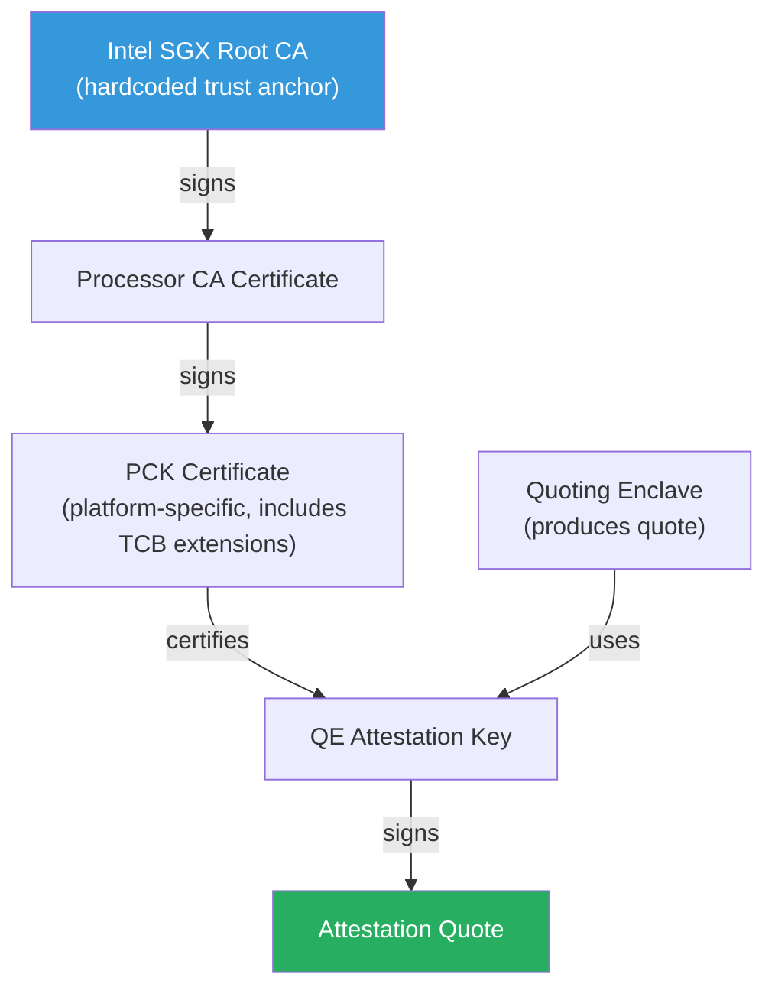
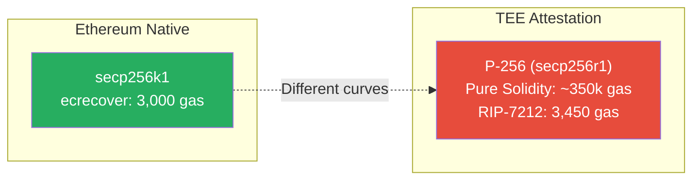
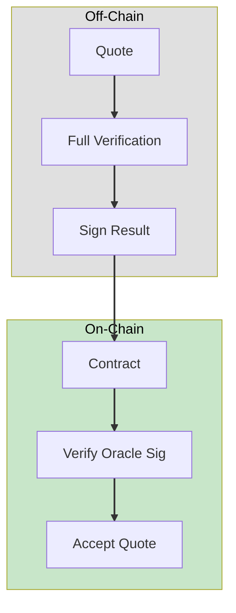
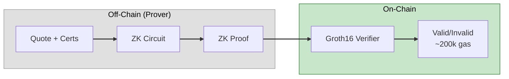
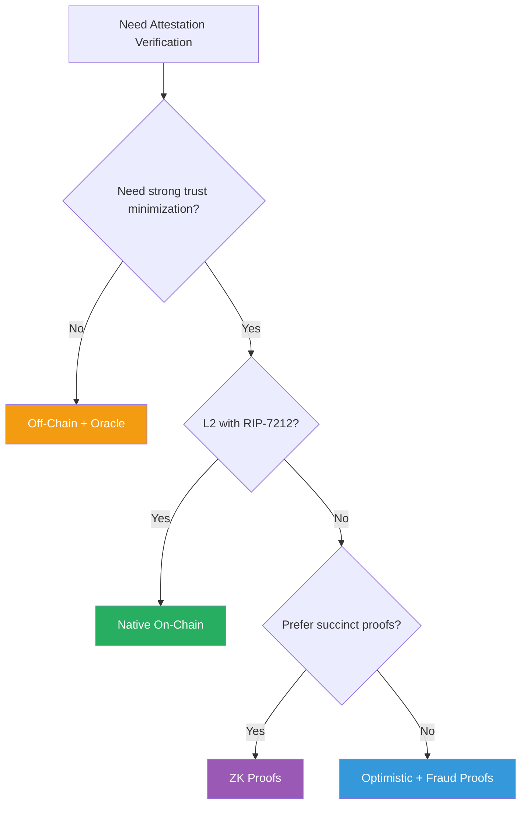

# Roots of Trust, Part I: X.509 Verification On-Chain

*X.509, TEE Attestation, and Verifiable Infrastructure*

---

[Trusted Execution Environments (TEEs)](https://en.wikipedia.org/wiki/Trusted_execution_environment) produce signed attestation quotes describing the identity and state of an enclave. That signature is validated against a certificate chain anchored to the hardware vendor's root CA. If you want trustless verification—no oracles, no multisigs, no "trust us"—you need to verify that chain on-chain.


While this post uses Intel's DCAP attestation model as a concrete example, the same verification challenges arise across modern TEE platforms including AMD SEV-SNP, AWS Nitro Enclaves, and ARM Confidential Compute Architecture.

This is harder than it sounds. The X.509 certificate infrastructure was designed for browsers and operating systems with gigabytes of memory and milliseconds to spare. The EVM gives you 30 million gas per block and charges you for every byte. This post explores the constraints, the approaches, and the tradeoffs for bringing X.509 verification into blockchain infrastructure.

---

## The Problem

A TEE attestation quote is cryptographically meaningless without its certificate chain. TEE platforms typically anchor attestation in a hardware vendor root
certificate. As a concrete example, consider Intel's [Data Center Attestation Primitives (DCAP)](https://download.01.org/intel-sgx/sgx-dcap/) model:



To verify a quote, you must:

1. Parse the quote structure to extract the signature and signed data
2. Extract the Quoting Enclave (QE) attestation key used to sign the quote
3. Verify the quote signature using the QE attestation key
4. Validate the QE attestation key against the platform's PCK certificate
5. Validate the PCK certificate against the Processor CA
6. Validate the Processor CA against the Intel Root CA
7. Check certificate validity periods, revocation status, and [Trusted Computing Base (TCB)](https://download.01.org/intel-sgx/sgx-dcap/) levels
8. Compare the enclave measurement against expected values

Steps 4–6 are X.509 operations. In a traditional system, libraries such as OpenSSL perform these checks in microseconds. On-chain, however, each operation has a cost—and some costs are prohibitive.

---

## Why On-Chain X.509 Is Hard

### ASN.1/DER Parsing

[X.509](https://en.wikipedia.org/wiki/X.509) certificates are encoded in [ASN.1 DER](https://en.wikipedia.org/wiki/X.690) format — a tag-length-value encoding with variable-length fields and nested structures. Parsing DER requires:
- Reading tags and determining types
- Handling multi-byte length encodings
- Traversing nested SEQUENCE and SET structures
- Extracting specific fields by OID

The EVM has no native support for any of this. Every byte comparison, every loop iteration, every memory operation costs gas. A typical X.509 certificate is 1–2 KB. Parsing it involves hundreds of operations.

Automata Network's [DCAP Attestation library](https://github.com/automata-network/automata-dcap-attestation) includes Solidity DER decoders. They work—but they're expensive. Parsing a PCK certificate and extracting extensions can cost tens of thousands of gas before you even verify a signature.

### Signature Algorithms

X.509 certificates in TEE attestation use standard algorithms:

| Algorithm | Usage | EVM Support |
|-----------|-------|-------------|
| ECDSA P-256 (secp256r1) | Intel PCK certs, modern attestation | RIP-7212 (L2s only) |
| RSA-2048/3072 | Root CAs, some intermediates | modexp precompile (0x05) |
| RSA-PSS | FIPS-compliant signatures | No native support |

**The curve mismatch problem:** Ethereum's native curve is secp256k1. The `ecrecover` precompile verifies secp256k1 signatures for 3,000 gas. But TEE attestation uses secp256r1 (P-256)—a different curve with different parameters.



Until recently, verifying P-256 on-chain required implementing elliptic curve arithmetic in Solidity. This cost 300,000–500,000 gas per signature. [RIP-7212](https://github.com/ethereum/RIPs/blob/master/RIPS/rip-7212.md) introduces a P-256 precompile at address `0x100`, reducing verification to 3,450 gas—but it's only available on L2s that have adopted it (Polygon, Optimism, Arbitrum, zkSync). [RIP-7212](https://github.com/ethereum/RIPs/blob/master/RIPS/rip-7212.md) introduces a P-256 precompile at address `0x100`, reducing verification to 3,450 gas—available on L2s that have adopted it (Polygon, Optimism, Arbitrum, zkSync). Ethereum mainnet has [EIP-7951](https://eips.ethereum.org/EIPS/eip-7951) (activated in Fusaka, December 2025) at 6,900 gas.

**RSA verification** uses the modexp precompile ([EIP-198](https://eips.ethereum.org/EIPS/eip-198)). For small exponents (e=3 or e=65537), this is surprisingly cheap—a few thousand gas depending on key size. The expensive part is the padding verification and hash comparison, which must be done in Solidity.

### Chain Traversal

Verifying a single signature is one operation. Verifying a certificate chain requires:

- Multiple signature verifications (one per chain link)
- Multiple certificate parses (to extract public keys and issuers)
- Extension parsing (to check CA constraints, key usage, TCB info)
- Validity period checks against block timestamp

A three-certificate chain with P-256 signatures costs roughly:

| Operation | Gas (with RIP-7212) | Gas (without) |
|-----------|---------------------|---------------|
| Parse 3 DER certificates | ~50,000 | ~50,000 |
| 3x P-256 signature verification | ~10,000 | ~1,000,000+ |
| Extension extraction | ~20,000 | ~20,000 |
| **Total** | **~80,000** | **~1,070,000** |

Without P-256 precompiles, full on-chain verification is impractical for most applications.
Given these constraints, several verification architectures have emerged in practice.

---

## Approaches

### 1. Native On-Chain Verification

**What it is:** Implement everything in Solidity—DER parsing, signature verification, chain validation, policy checks.

**Who's doing it:** Automata Network has the most complete implementation. Their DCAP Attestation library provides:

- On-chain PCCS (Provisioning Certificate Caching Service) for storing collateral
- DER decoders for PCK certificates, TCBInfo, QE identity
- Full quote verification in Solidity


**Tradeoffs:**

| Pro | Con |
|-----|-----|
| Fully trustless | High gas costs (100k–500k+ depending on chain) |
| No external dependencies | Requires RIP-7212 for practical P-256 costs |
| Composable with other contracts | Complex, large attack surface |

**When to use:** When you need synchronous, atomic verification in the same transaction as your application logic. Works best on L2s with RIP-7212 support.

### 2. Precompiles

**What exists:**

| Precompile | Address | Function | Gas |
|------------|---------|----------|-----|
| ecrecover | 0x01 | secp256k1 recovery | 3,000 |
| modexp | 0x05 | Modular exponentiation (RSA) | Variable |
| ecAdd | 0x06 | BN254 point addition | 150 |
| ecMul | 0x07 | BN254 scalar multiplication | 6,000 |
| ecPairing | 0x08 | BN254 pairing check | 34,000/pair |
| P256VERIFY | 0x100 | secp256r1 verification (RIP-7212) | 3,450 |

**What's missing:**

- **ASN.1/DER parsing:** No precompile exists. Every project implements this in Solidity.
- **RSA-PSS padding:** modexp handles the exponentiation, but PSS verification requires additional Solidity logic.
- **SHA-384:** Used in some certificate signatures. Available via SHA2-384 but costs more than SHA-256.
- **Certificate chain validation:** No precompile for "verify this X.509 chain."

**The path forward:** RIP-7212 was the first Rollup Improvement Proposal. Its success demonstrates that L2s can coordinate on precompiles faster than mainnet. Future RIPs could add:

- RSA signature verification (beyond raw modexp)
- ASN.1 parsing helpers
- Certificate chain verification as a single call

### 3. Off-Chain Verification + On-Chain Commitment

**What it is:** Verify the attestation off-chain, then submit a commitment (hash, signature, or proof) on-chain.

**Patterns:**



**Oracle-based:** A trusted party verifies attestations and signs the results. The contract trusts the oracle's signature.

```solidity
function verifyAttestation(
    bytes calldata quote,
    bytes calldata oracleSignature
) external {
    bytes32 quoteHash = keccak256(quote);
    address signer = recoverSigner(quoteHash, oracleSignature);
    require(signer == trustedOracle, "Invalid oracle signature");
    // Quote is considered verified
}
```

**Optimistic:** Accept attestations by default, allow a challenge period for fraud proofs.

```solidity
mapping(bytes32 => uint256) public attestationTimestamps;

function submitAttestation(bytes32 quoteHash) external {
    attestationTimestamps[quoteHash] = block.timestamp;
}

function challengeAttestation(bytes32 quoteHash, bytes calldata fraudProof) external {
    require(block.timestamp < attestationTimestamps[quoteHash] + CHALLENGE_PERIOD);
    // Verify fraud proof shows invalid attestation
    // If valid, slash submitter and reward challenger
}
```

**Threshold signatures:** A committee of verifiers must sign off on each attestation. k-of-n threshold prevents single points of failure.

**Tradeoffs:**

| Pro | Con |
|-----|-----|
| Low gas cost (~21,000 for hash + signature check) | Introduces trust assumptions |
| Works on any chain | Latency (for optimistic approaches) |
| Simple implementation | Oracle liveness/collusion risk |

**When to use:** When gas costs dominate and you can tolerate additional trust assumptions. Appropriate for high-volume, lower-stakes attestations.

### 4. ZK Certificate Verification

**What it is:** Generate a zero-knowledge proof that you correctly verified a certificate chain. Submit only the proof on-chain.



**The approach:**

1. Off-chain: Parse certificates, verify signatures, validate chain
2. Off-chain: Generate a ZK proof of correct verification
3. On-chain: Verify the ZK proof (constant cost regardless of chain length)

**Existing work:**

- **zkemail's ASN.1 parser (Circom):** Parses DER structures and extracts fields in a ZK circuit. Still experimental, not production-ready.
- **Rarimo's ZK Passport:** Verifies passport certificates using both Circom and Noir circuits. Demonstrates that X.509 verification in ZK is feasible.
- **Automata + RISC Zero/SP1:** Compresses DCAP verification into a zkVM proof, reducing on-chain costs to a single Groth16 verification (~200k gas).

**Circuit complexity:**

| Operation | Constraint Estimate |
|-----------|---------------------|
| SHA-256 hash | ~30,000 |
| P-256 signature verification | ~500,000+ |
| DER parsing (variable) | ~10,000–50,000 |
| Full chain verification | ~1,500,000+ |

[Groth16](https://eprint.iacr.org/2016/260) proof verification costs roughly ~181,000 gas plus ~6,000 gas per public input, independent of circuit size. For complex attestation verification, ZK can be cheaper than native Solidity.

**Tradeoffs:**

| Pro | Con |
|-----|-----|
| Constant on-chain cost | High off-chain prover time (seconds to minutes) |
| Privacy-preserving (can hide certificate details) | Circuit development complexity |
| Works without new precompiles | Trusted setup (for Groth16) |

**When to use:** When you need full verification guarantees without trusting an oracle, and can tolerate proof generation latency. Ideal for batch verification where one proof covers multiple attestations.

---

## Current Landscape

| Project | Approach | Chain Support |
|---------|----------|---------------|
| [Automata Network](https://github.com/automata-network/automata-dcap-attestation) | Native Solidity + zkVM proofs | EVM chains, Solana |
| [Flashbots SUAVE](https://github.com/flashbots/suave-geth) | Native (with Automata) | Ethereum |
| [Phala Network](https://github.com/Phala-Network/phala-blockchain) | Off-chain verification | Substrate |
| [Oasis Network](https://github.com/oasisprotocol/oasis-core) | Consensus-based verification | Oasis |
| [Taiko](https://github.com/taikoxyz/raiko) | Native (with Automata) | Taiko L2 |
| [Puffer Finance](https://github.com/PufferFinance/rave) | Native (RAVe contracts) | Ethereum |

Most production deployments today use Automata's DCAP library or a hybrid approach combining off-chain verification with on-chain commitments. Pure on-chain verification is becoming practical on L2s with RIP-7212, but remains expensive on mainnet.

---

## Design Tradeoffs

The choice of verification approach depends on your constraints:



| If you need... | Consider... |
|----------------|-------------|
| Atomic, synchronous verification | Native on-chain |
| Lowest gas cost | Off-chain + oracle |
| Trustlessness without new precompiles | ZK proofs |
| Mainnet compatibility | ZK proofs or optimistic |
| L2 deployment | Native (with RIP-7212) |
| High throughput | Batch ZK proofs |

There's no universally correct answer. The TEE + L2 space is converging on a practical middle ground: verify off-chain using native code, generate a succinct proof (ZK or threshold signature), and verify that proof on-chain.

---

## Looking Ahead

Full on-chain X.509 verification is the end goal—it eliminates all external trust assumptions. The path there requires:

1. **More precompiles:** P-256 is landing on L2s. RSA and ASN.1 helpers would further reduce costs.
2. **ZK maturity:** As prover performance improves and tooling matures, ZK verification becomes more practical.
3. **Standardization:** Common interfaces for attestation verification (like Automata's approach) let applications swap implementations without code changes.

For now, the constraint is gas. Every approach trades off verification cost against trust assumptions. Understanding X.509 infrastructure—what needs to be verified and why—is the foundation for making that tradeoff intelligently.

---


**Next:** [Part II — TEE Attestation Model](02-tee-attestation-model.md)
