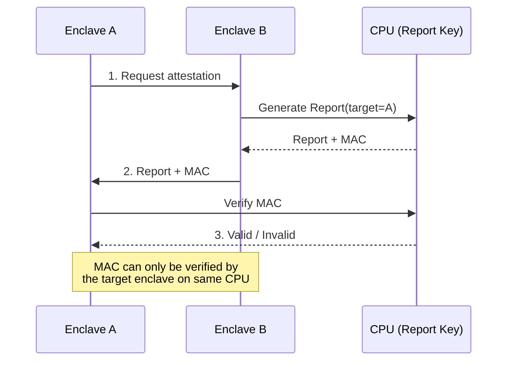
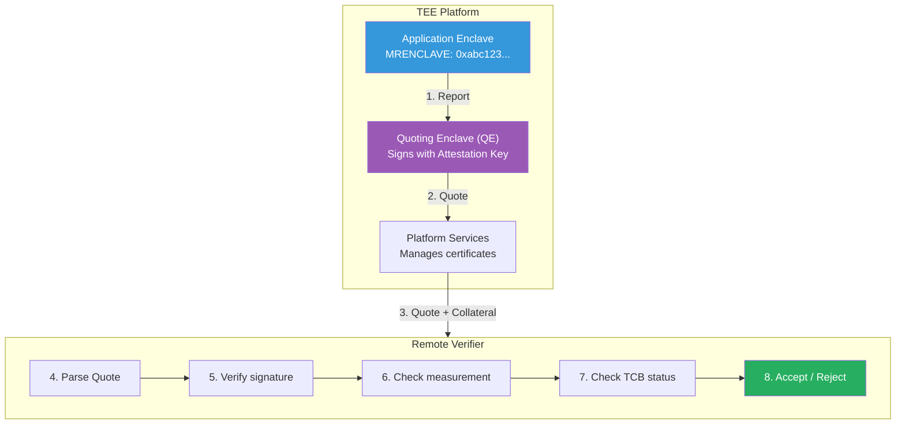
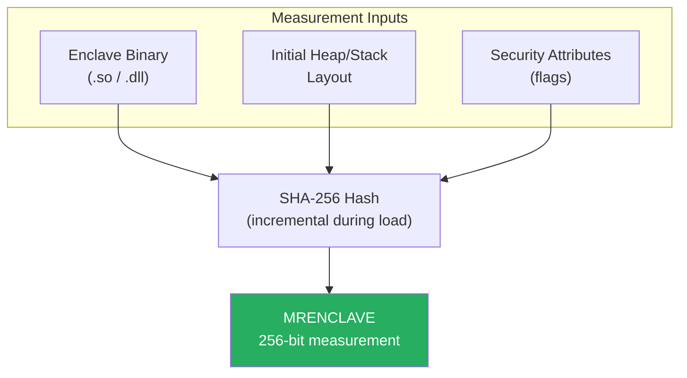
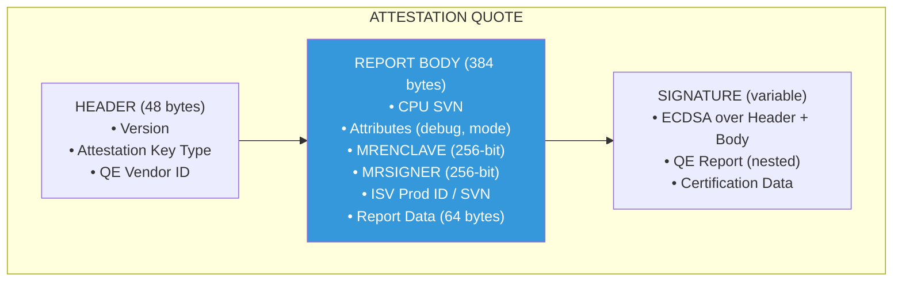
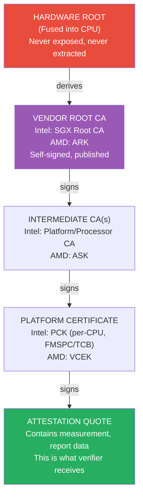
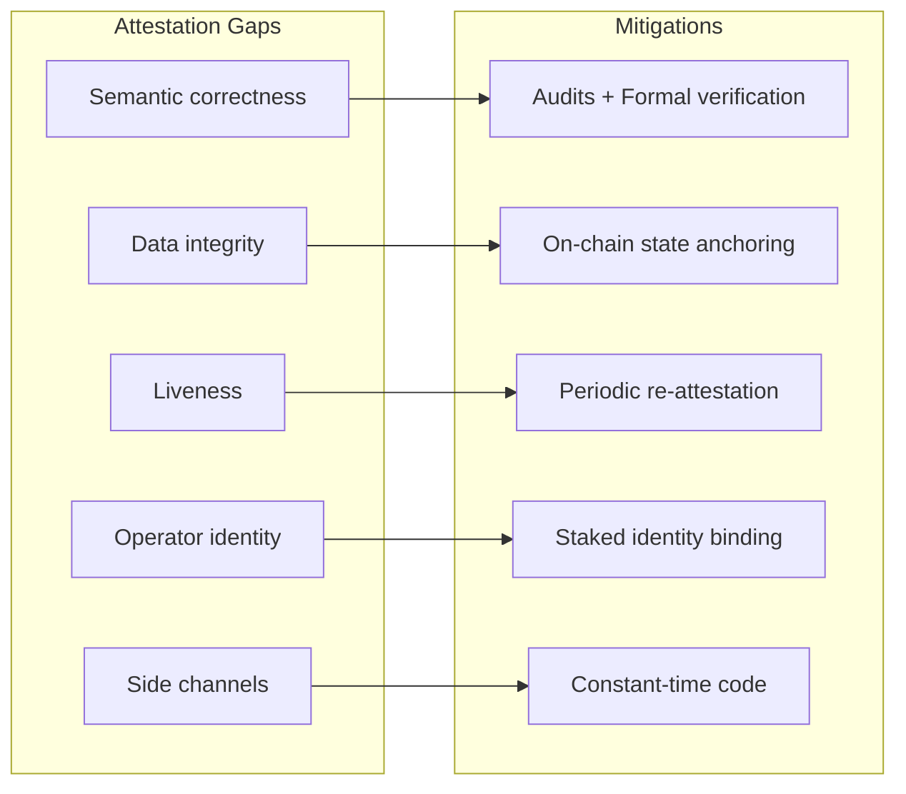
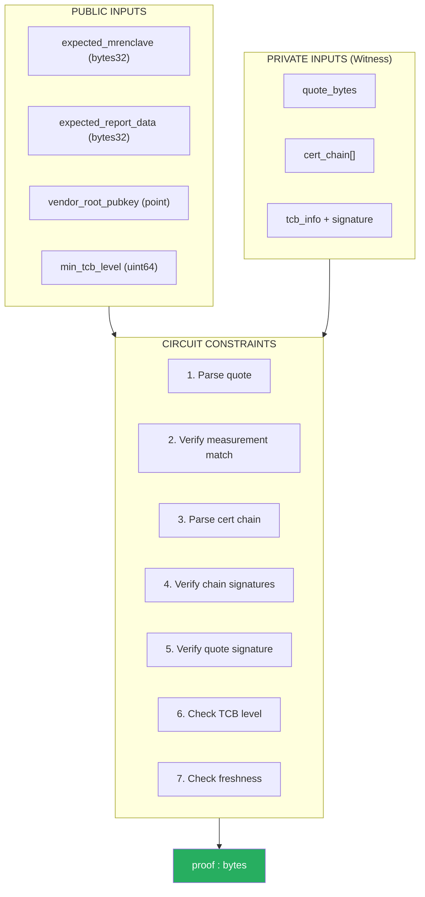
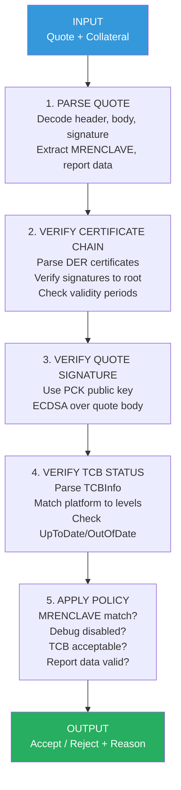

# Roots of Trust, Part II: TEE Attestation Model

*X.509, TEE Attestation, and Verifiable Infrastructure*

---

Attestation is the mechanism by which a TEE proves its identity to an external party. It answers a deceptively simple question: *Is this specific code running on genuine hardware in a secure configuration?*

The answer takes the form of a cryptographic proof—a signed statement that binds a measurement (hash of the enclave) to a hardware-rooted key. This proof is non-interactive: the verifier doesn't need to communicate with the enclave during verification. They receive a blob, validate it against known-good values, and decide whether to trust the enclave's outputs.

This post covers the attestation model independent of any specific platform. We'll examine local and remote attestation, how measurements establish identity, what the resulting quote contains, and how verification works—including how attestation maps to ZK circuits for on-chain verification.

---

## What Is Attestation?

At its core, attestation solves a remote trust problem.

When you connect to a server over HTTPS, you trust the certificate chain anchored to a CA in your browser's root store. But that certificate only proves the server controls a domain—it says nothing about what software is running or whether the server operator can read your data.

TEE attestation goes further. It proves:

1. **Code identity:** The enclave is running a specific binary (identified by its hash)
2. **Hardware authenticity:** The CPU is genuine, manufactured by the claimed vendor
3. **Configuration integrity:** Security-relevant settings (debug mode, memory encryption) are in the expected state

The proof is rooted in hardware. A key burned into the CPU during manufacturing signs the attestation. No software—not the OS, not the hypervisor, not even the enclave itself—can forge this signature.

---

## Local Attestation

Local attestation enables two enclaves on the same physical CPU to verify each other without involving any external party.

### The Flow

**Step 1:** Enclave A requests attestation from Enclave B, providing a challenge (e.g., a nonce or Enclave A's measurement).

**Step 2:** Enclave B generates a **report** containing:
- Its own measurement
- The target enclave's measurement (Enclave A)
- User-defined data (the challenge, a public key, application data)
- A MAC (Message Authentication Code) computed using a CPU-derived report key

**Step 3:** Enclave A verifies the MAC using the same report key. This key is derived deterministically from hardware secrets and the target enclave's identity—only the genuine CPU can produce it, and only Enclave A can verify MACs targeted to itself.

### Why Local Attestation Matters

Local attestation is the foundation for:

- **Multi-enclave architectures:** A "coordinator" enclave can verify worker enclaves before delegating sensitive tasks
- **Key provisioning:** A provisioning enclave can verify an application enclave before releasing secrets
- **Secure channels:** Two enclaves can establish authenticated encrypted channels after mutual attestation

Local attestation is fast (no network round-trips) and private (no external party sees the attestation). The limitation is scope: it only works between enclaves on the same physical CPU.

---

## Remote Attestation

Remote attestation extends the trust proof to any external verifier—across networks, organizations, or even on-chain.

### The Flow

### Report vs Quote

The **report** is a local structure—it contains a MAC that only the same CPU can verify. It cannot be validated by an external party.

The **quote** transforms the report into a portable proof. A special enclave called the **Quoting Enclave (QE)** performs this transformation:

1. QE verifies the application enclave's report via local attestation
2. QE re-signs the report data using an **Attestation Key** that chains to the hardware vendor's root CA
3. The resulting quote can be verified by anyone with the vendor's root certificate

This indirection exists because the raw hardware keys should never be exposed in a way that allows tracking CPUs across contexts. The QE provides a layer of abstraction while preserving the hardware root of trust.

### Collateral

A quote alone isn't sufficient for verification. The verifier also needs **collateral**:

- **Certificate chain:** Links the quote signature to the vendor root
- **TCB information:** Current security level of the platform (microcode version, known vulnerabilities)
- **Revocation data:** Certificates or platforms that have been revoked

Intel's DCAP (Data Center Attestation Primitives) model provides this collateral through a Provisioning Certificate Caching Service (PCCS). On-chain systems like Automata's replicate this collateral on-chain for trustless access.

---

## Measurements and Identity

A measurement is a cryptographic hash that uniquely identifies an enclave. It's computed at enclave load time and becomes immutable—the enclave cannot modify its own measurement.

### Measurement Derivation

The measurement includes:

- **Code:** Every page of the enclave binary, in load order
- **Data layout:** Initial heap and stack configuration
- **Security attributes:** Flags like debug mode, KSS (Key Separation & Sharing), memory encryption mode

Any change—a single byte in the binary, a different compiler flag, a modified linker script—produces a different measurement.

### Two Types of Identity

| Measurement | What It Identifies | Use Case |
|-------------|-------------------|----------|
| **MRENCLAVE** | Exact code + config | "This specific build of this specific application" |
| **MRSIGNER** | Signing key of enclave author | "Any enclave signed by this author" |

**MRENCLAVE** is the stricter check. It changes with every rebuild unless builds are perfectly reproducible. Use it when you need to pin to an exact version.

**MRSIGNER** allows for enclave updates without changing the expected identity. Use it when you trust the enclave author to ship safe updates—but recognize this means trusting their build and release process.

### Reproducible Builds Matter

For MRENCLAVE-based verification, anyone should be able to:

1. Take the source code
2. Build it with documented toolchain and flags
3. Get the same measurement as the deployed enclave

If builds aren't reproducible, verifiers must trust whoever published the expected measurement. This undermines the "don't trust, verify" property that makes attestation valuable.

Frameworks like Gramine, Occlum, and EGo provide tooling for reproducible enclave builds. For production deployments, reproducibility is not optional.

---

## The Quote Structure

A quote is a structured blob containing everything a verifier needs (except collateral, which is fetched separately).

### Quote Anatomy

### The Report Data Field

The 64-byte **Report Data** field is critical for binding attestation to application context. Common patterns:

| Usage | What Goes in Report Data |
|-------|-------------------------|
| **Freshness** | Hash of verifier-provided nonce |
| **Key binding** | Hash of enclave's ephemeral public key |
| **State commitment** | Hash of enclave's current state root |
| **Channel binding** | TLS session identifier |

For on-chain verification, report data typically contains the hash of a public key. This binds the attestation to a specific key pair, allowing the enclave to sign subsequent messages that the chain can verify.

### ZK Perspective: Quote as Circuit Input

When verifying a quote in a ZK circuit, fields partition into:

| Field | ZK Role |
|-------|---------|
| MRENCLAVE | Public input (verifier must know expected value) |
| Report Data | Public input (contains commitments to verify) |
| Signature | Private input (verified in-circuit, not revealed) |
| Certificate chain | Private input (verified in-circuit) |

The ZK proof states: "I know a valid quote with these public measurements, signed by a chain anchored to a known root." The verifier learns the measurements without seeing the raw quote or certificates.

---

## Trust Anchors and Certificate Chains

Remote attestation is only as trustworthy as its root of trust. Understanding what you're trusting is essential.

### The Trust Chain

### What You're Trusting

When you verify an attestation, you implicitly trust:

| Entity | What You're Trusting |
|--------|---------------------|
| **Hardware vendor** | CPU correctly implements isolation, doesn't leak keys |
| **Vendor PKI** | Root CA private key is secure, cert issuance is correct |
| **Microcode** | No bugs or backdoors in CPU firmware |
| **Collateral source** | TCB info and revocation data are accurate and fresh |

This is a significant trust surface. Hardware vulnerabilities (Spectre, Foreshadow, etc.) have repeatedly demonstrated that "hardware root of trust" doesn't mean "unconditionally secure." Attestation proves the enclave matches expectations *given current known vulnerabilities*—the TCB status encodes this.

### Minimizing Trust with ZK

ZK proofs can reduce what the verifier must trust:

- **Collateral freshness:** Prove the TCB info was fetched after a certain block height
- **Policy compliance:** Prove the measurement matches one of N approved binaries without revealing which
- **Selective disclosure:** Prove properties of the attestation (e.g., "not debug mode") without revealing the full quote

The hardware trust remains—ZK can't fix a compromised CPU. But ZK can minimize trust in the verification infrastructure.

---

## What Attestation Proves vs. Doesn't Prove

This distinction is critical. Misunderstanding it leads to security architectures that look solid but have fundamental gaps.

### What Attestation Proves

| Property | Guarantee |
|----------|-----------|
| **Code identity** | The binary hash matches the expected measurement |
| **Hardware authenticity** | The signature chains to a genuine vendor root |
| **Platform integrity** | CPU, microcode, and security config match the TCB level |
| **Freshness** | If nonce is validated, the quote was generated recently |

### What Attestation Does NOT Prove

| Gap | Implication |
|-----|-------------|
| **Semantic correctness** | The code could be buggy or malicious |
| **Data integrity** | Enclave could be processing stale or rolled-back state |
| **Liveness** | Enclave could be offline or unresponsive |
| **Operator identity** | Quote says *what* is running, not *who* operates it |
| **Side-channel resistance** | Code could leak secrets via timing, cache, etc. |
| **Post-compromise security** | If previously compromised, secrets may already be exfiltrated |

### Bridging the Gaps

This is the "Attestation Is Not Enough" thesis: attestation is necessary but not sufficient. It's a foundation, not a complete security architecture.

---

## Attestation in ZK Circuits

Moving attestation verification into a ZK circuit enables trustless on-chain verification without requiring expensive precompiles or trusting an oracle. Here's how it maps.

### Circuit Architecture

### Constraint Breakdown

| Operation | Constraint Type | Approximate Cost |
|-----------|-----------------|------------------|
| DER parsing | Byte manipulation, conditionals | ~10,000–50,000 R1CS constraints |
| SHA-256 hash | Bit decomposition, rounds | ~30,000 constraints per hash |
| ECDSA P-256 verify | Field arithmetic, curve ops | ~500,000 constraints |
| RSA-3072 verify | Bigint multiplication, modexp | ~1,000,000+ constraints |
| Comparison checks | Simple assertions | Negligible |

A full attestation verification circuit with one P-256 signature and two-certificate chain typically requires **1.5–2 million constraints**. This is large but tractable for modern proving systems.

### Prover Performance

| Proving System | Proof Time (2M constraints) | Proof Size | Verification Gas |
|----------------|----------------------------|------------|------------------|
| Groth16 | 30–60 seconds | ~200 bytes | ~200,000 |
| PLONK | 60–120 seconds | ~500 bytes | ~300,000 |
| STARK (via zkVM) | 2–5 minutes | ~50 KB | ~500,000 |

Groth16 offers the best on-chain verification cost but requires a trusted setup per circuit. zkVMs like RISC Zero and SP1 allow general-purpose verification without circuit-specific setup, at the cost of larger proofs.

### Practical Implementations

**Automata + RISC Zero:** Run full DCAP verification logic in a RISC Zero guest program. The zkVM generates a proof that the verification passed. On-chain, verify only the RISC Zero proof.

**zkemail ASN.1 circuits:** Circom circuits for parsing DER structures, extracting fields, and generating proofs. Still experimental but demonstrates feasibility.

**Rarimo ZK Passport:** Production circuits for verifying passport attestations (which use X.509 internally). Proves that P-256/RSA signature verification in ZK is viable.

### ZK Design Considerations

**Public vs. private inputs:** Minimize public inputs to reduce on-chain verification cost. The measurement and report data are typically public; everything else can be private.

**Batching:** One proof can cover multiple attestations. If you're verifying N enclaves, batch them into one proof rather than N separate proofs.

**Recursion:** Aggregate multiple attestation proofs into a single proof. This amortizes verification cost across many attestations.

**Updateability:** If vendor root keys or TCB policies change, the circuit may need updating. Design for governance over these parameters.

---

## The Verifier's Job

Whether verification happens off-chain, on-chain, or in a ZK circuit, the logical steps are the same.

### End-to-End Verification Flow

### Verification Approaches Compared

| Approach | Where Verification Runs | Trust Assumption | Gas Cost |
|----------|------------------------|------------------|----------|
| Native Solidity | On-chain | None (trustless) | 100k–1M+ |
| Oracle | Off-chain (oracle signs result) | Trust oracle | ~25k |
| Optimistic | Off-chain (fraud proof on-chain) | 1-of-N honest verifier | ~25k (happy path) |
| ZK Proof | Off-chain (proof generated), on-chain (proof verified) | Proving system soundness | ~200k |
| Consensus | Off-chain (validator set agrees) | BFT threshold honest | ~25k |

For blockchain applications, ZK verification increasingly represents the best tradeoff: trustless guarantees with manageable on-chain cost.

---

## Looking Ahead

This post covered attestation concepts that apply across platforms. The model is consistent whether you're working with Intel SGX, AMD SEV-SNP, or other TEE implementations.

The next post dives into Intel DCAP specifically—the certificate hierarchy, FMSPC codes, TCB levels, and QE identity verification. These are the concrete details you need to implement or audit a DCAP-based system.

Later in the series, we will cover cross-platform differences (AMD SEV-SNP, AWS Nitro, ARM CCA) and how to build verification infrastructure that abstracts over them.

---

---

**Previous:** [Part I — X.509 Verification On-Chain](01-x509-verification-on-chain.md)  
**Next:** [Part III — Intel DCAP Certificate Hierarchy](03-intel-dcap-certificate-hierarchy.md)
