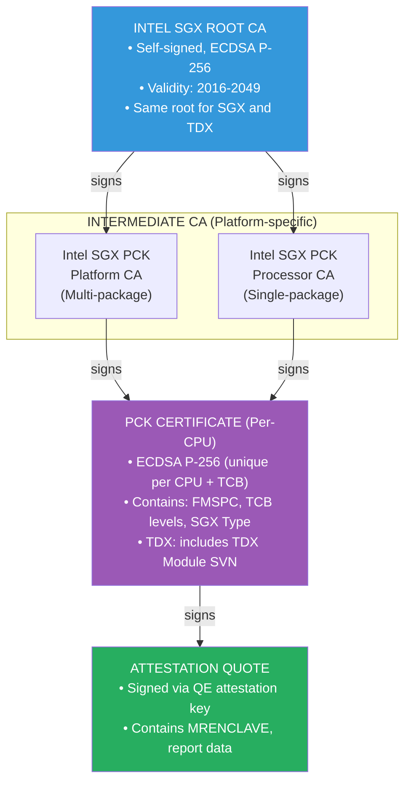
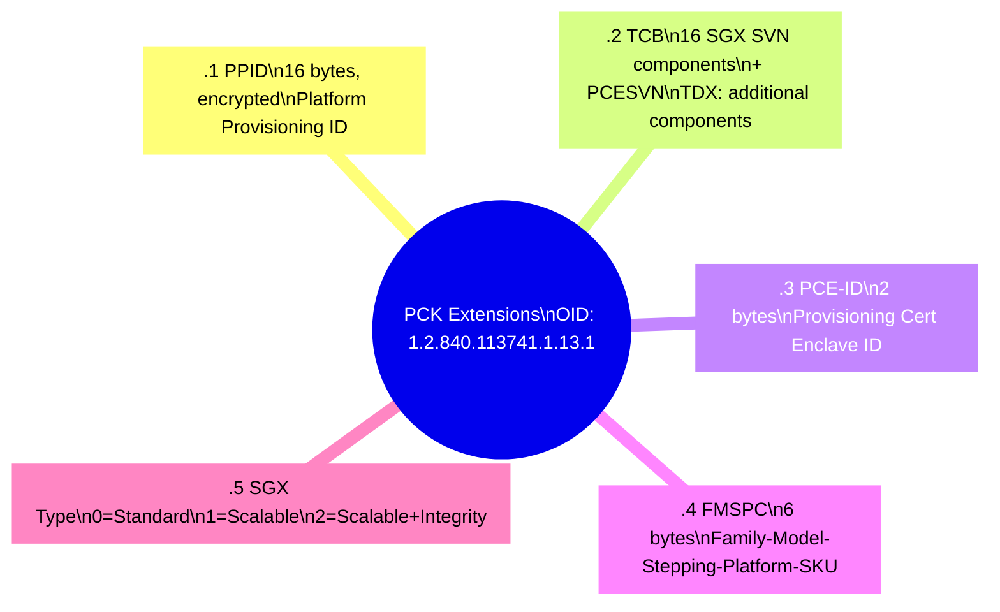
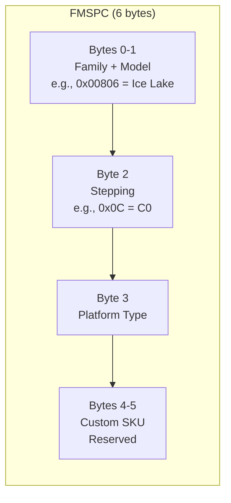
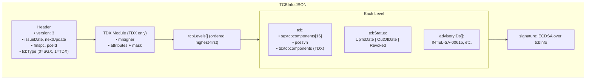
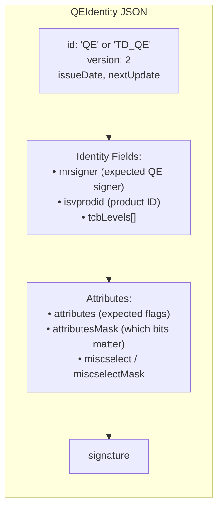
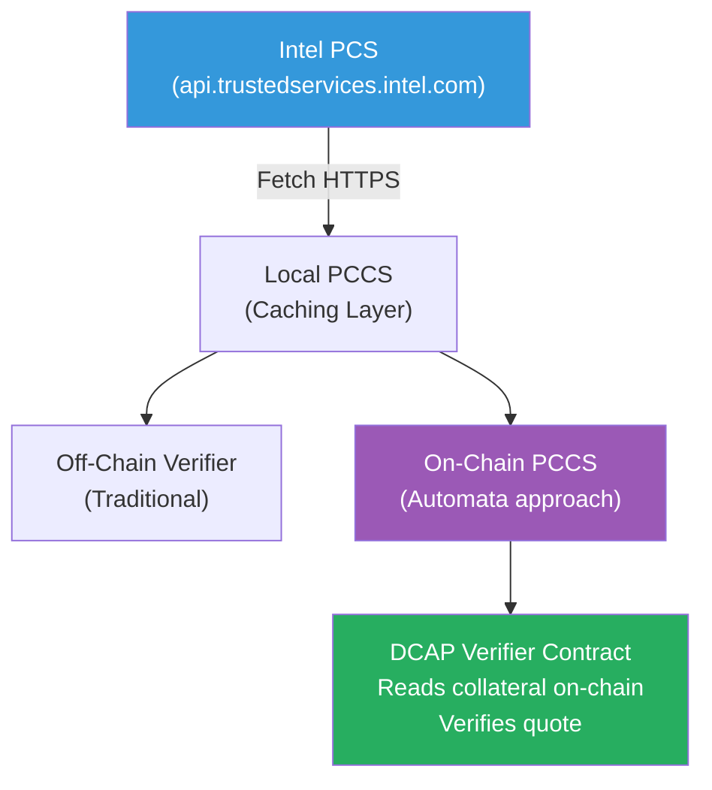
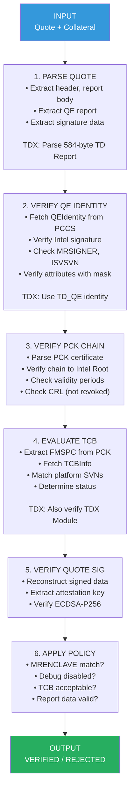
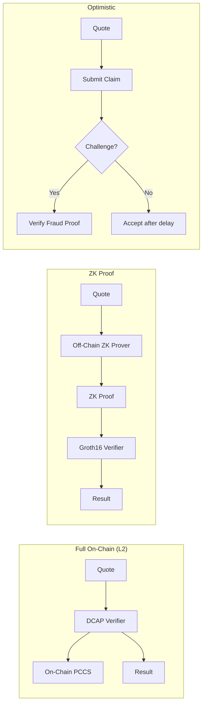

# Roots of Trust, Part III: Intel DCAP Certificate Hierarchy

*X.509, TEE Attestation, and Verifiable Infrastructure*

---

Intel's Data Center Attestation Primitives (DCAP) is the attestation framework for SGX and TDX in data center environments. Unlike the older EPID model—which relied on Intel's attestation service as a central verifier—DCAP enables fully decentralized verification. Anyone with the right collateral can verify a quote without contacting Intel.

This makes DCAP the natural fit for blockchain applications. But DCAP verification requires understanding a specific certificate hierarchy, proprietary extensions, and a collateral system that doesn't map cleanly to standard PKI patterns.

This post is the technical reference. We'll cover the certificate chain structure, PCK certificate extensions, FMSPC encoding, TCB status evaluation, and how this maps to on-chain verification—including Solidity snippets and TDX-specific differences throughout.

---

## DCAP Overview

### DCAP vs EPID

Intel has shipped two attestation models:

| Aspect | EPID (legacy) | DCAP (current) |
|--------|---------------|----------------|
| **Verification** | Intel Attestation Service (IAS) | Anyone with collateral |
| **Privacy** | Group signatures (unlinkable) | Standard ECDSA (linkable per-platform) |
| **Infrastructure** | Requires Intel online service | Fully offline-capable |
| **Use case** | Consumer devices, privacy-sensitive | Data centers, blockchain |

EPID used group signatures to provide unlinkability—multiple attestations from the same CPU couldn't be correlated. DCAP trades this for decentralization: each CPU has a unique Provisioning Certification Key (PCK), and anyone can verify quotes against the certificate chain.

For blockchain applications, DCAP's properties are essential. You can't build trustless on-chain verification if verification requires calling Intel's API.

### SGX vs TDX in DCAP

DCAP supports both SGX (Software Guard Extensions) and TDX (Trust Domain Extensions). The certificate hierarchy and collateral system are shared, but quote structures differ:

| Aspect | SGX | TDX |
|--------|-----|-----|
| **Isolation unit** | Enclave (process-level) | Trust Domain (VM-level) |
| **Quote version** | Version 3 | Version 4 |
| **Measurement** | MRENCLAVE (code hash) | MRTD (TD measurement) + RTMR (runtime) |
| **Report body** | 384 bytes | 584 bytes (includes TD-specific fields) |
| **TCB components** | SGX TCB (16 SVNs) | TDX TCB (includes TDX Module SVN) |

The verification pipeline is structurally identical. We'll note TDX-specific differences where they impact implementation.

---

## The Certificate Hierarchy

DCAP uses a three-level certificate hierarchy anchored to Intel's root CA.



### Certificate Retrieval

PCK certificates are retrieved from Intel's Provisioning Certification Service (PCS) using platform-specific identifiers. The flow:

1. Platform registers with Intel during provisioning
2. Intel issues PCK certificate based on CPU identity and current TCB
3. Certificate cached locally (PCCS) or fetched on-demand
4. Verifier obtains certificate as part of collateral

For on-chain verification, the collateral (including PCK cert) must be available on-chain or passed as calldata.

---

## PCK Certificate Deep Dive

The PCK certificate is a standard X.509v3 certificate with Intel-specific extensions. These extensions encode platform identity and TCB information that verifiers must parse and evaluate.

### Standard Fields

| Field | Value |
|-------|-------|
| Version | v3 |
| Serial Number | Unique per certificate |
| Issuer | CN=Intel SGX PCK Platform CA or Processor CA |
| Validity | ~5 years from issuance |
| Subject | CN=Intel SGX PCK Certificate |
| Public Key | ECDSA P-256 |
| Signature Algorithm | ecdsa-with-SHA256 |

### Intel-Specific Extensions

Intel defines extensions under the OID arc `1.2.840.113741.1.13.1`. These are non-critical extensions.



### Parsing PCK Extensions in Solidity

The following demonstrates parsing PCK certificate extensions. This is architecturally similar to Automata's approach.

```solidity
// SPDX-License-Identifier: MIT
pragma solidity ^0.8.19;

/// @title PCK Certificate Extension Parser
/// @notice Extracts Intel SGX/TDX specific extensions from PCK certificates

library PCKExtensionParser {
    // Intel SGX Extension OIDs
    // 1.2.840.113741.1.13.1 = 06 09 2A 86 48 86 F8 4D 01 0D 01
    bytes constant SGX_EXTENSION_OID = hex"2A8648864D010D01";
    
    // Sub-OIDs (appended to base)
    uint8 constant OID_PPID = 1;
    uint8 constant OID_TCB = 2;
    uint8 constant OID_PCEID = 3;
    uint8 constant OID_FMSPC = 4;
    uint8 constant OID_SGX_TYPE = 5;
    
    struct PCKExtensions {
        bytes6 fmspc;
        bytes2 pceId;
        uint8 sgxType;
        TCBLevels tcb;
    }
    
    struct TCBLevels {
        uint8[16] sgxTcbCompSvn;  // 16 component SVNs
        uint16 pcesvn;
        // For TDX: additional fields
        uint8[16] tdxTcbCompSvn;  // TDX-specific
        bool isTdx;
    }
    
    /// @notice Parse extensions from DER-encoded PCK certificate
    function parseExtensions(bytes memory certDer) 
        internal 
        pure 
        returns (PCKExtensions memory ext) 
    {
        // Find extensions sequence (context tag [3])
        uint256 extOffset = findExtensionsOffset(certDer);
        require(extOffset > 0, "Extensions not found");
        
        // Iterate through extensions
        uint256 pos = extOffset;
        while (pos < certDer.length) {
            (bytes memory oid, bytes memory value, uint256 nextPos) = 
                parseExtension(certDer, pos);
            
            if (nextPos == 0) break;
            
            // Check if this is an Intel SGX extension
            if (startsWith(oid, SGX_EXTENSION_OID)) {
                uint8 subOid = uint8(oid[oid.length - 1]);
                parseIntelExtension(subOid, value, ext);
            }
            
            pos = nextPos;
        }
    }
    
    // Helper functions (implementations omitted for brevity)
    function findExtensionsOffset(bytes memory der) 
        internal pure returns (uint256);
    function parseExtension(bytes memory der, uint256 offset) 
        internal pure returns (bytes memory oid, bytes memory value, uint256 nextPos);
    function startsWith(bytes memory data, bytes memory prefix) 
        internal pure returns (bool);
}
```

---

## FMSPC and Platform Identification

FMSPC (Family-Model-Stepping-Platform-CustomSKU) is the 6-byte identifier that maps a CPU to its TCBInfo. Understanding FMSPC is essential for collateral retrieval and verification.

### FMSPC Structure



**Example FMSPC values:**
- `00906ED500FF`: Xeon Scalable (Ice Lake)
- `00806C0100FF`: Xeon E (Coffee Lake)
- `00A06F0500FF`: Xeon Scalable 4th Gen (Sapphire Rapids)

### Why FMSPC Matters

1. **TCBInfo lookup:** Each FMSPC has a corresponding TCBInfo JSON that defines valid TCB levels for that platform
2. **Collateral matching:** The verifier must fetch TCBInfo matching the quote's FMSPC
3. **Platform differentiation:** Two CPUs with same microarchitecture but different FMSPC may have different TCB recovery schedules

---

## TCBInfo Structure

TCBInfo is a signed JSON document from Intel that defines the security levels for a specific platform (identified by FMSPC). The verifier compares the quote's TCB against this document to determine the platform's security status.

### TCBInfo Schema



### TCB Status Values

| Status | Meaning | Recommended Action |
|--------|---------|-------------------|
| `UpToDate` | Platform TCB is current | Accept |
| `SWHardeningNeeded` | Mitigations required in software | Accept with advisory check |
| `ConfigurationNeeded` | Platform config needs update | Policy decision |
| `ConfigurationAndSWHardeningNeeded` | Both above | Policy decision |
| `OutOfDate` | TCB is outdated | Reject or accept with risk |
| `OutOfDateConfigurationNeeded` | Outdated + config issue | Reject |
| `Revoked` | Platform compromised | Reject |

### TCB Level Matching Algorithm

The verifier must find the highest TCB level where the platform's SVNs meet or exceed all component requirements:

```solidity
/// @title TCB Level Evaluator
/// @notice Determines TCB status based on platform SVNs and TCBInfo

library TCBEvaluator {
    struct TCBLevel {
        uint8[16] sgxTcbCompSvn;
        uint16 pcesvn;
        uint8[16] tdxTcbCompSvn;  // Empty for SGX-only
        string status;
    }
    
    /// @notice Find matching TCB level for platform
    function evaluateTcb(
        PCKExtensionParser.TCBLevels memory platformTcb,
        TCBLevel[] memory tcbLevels
    ) internal pure returns (string memory status, uint256 levelIndex) {
        
        for (uint256 i = 0; i < tcbLevels.length; i++) {
            if (tcbMeetsLevel(platformTcb, tcbLevels[i])) {
                return (tcbLevels[i].status, i);
            }
        }
        
        revert("TCB below minimum known level");
    }
    
    /// @notice Check if platform TCB meets or exceeds a level
    function tcbMeetsLevel(
        PCKExtensionParser.TCBLevels memory platform,
        TCBLevel memory level
    ) internal pure returns (bool) {
        // All SGX components must meet or exceed
        for (uint8 i = 0; i < 16; i++) {
            if (platform.sgxTcbCompSvn[i] < level.sgxTcbCompSvn[i]) {
                return false;
            }
        }
        
        // PCESVN must meet or exceed
        if (platform.pcesvn < level.pcesvn) {
            return false;
        }
        
        // For TDX: also check TDX components
        if (platform.isTdx) {
            for (uint8 i = 0; i < 16; i++) {
                if (platform.tdxTcbCompSvn[i] < level.tdxTcbCompSvn[i]) {
                    return false;
                }
            }
        }
        
        return true;
    }
}
```

---

## Quoting Enclave Identity

The QE (Quoting Enclave) is Intel's signed enclave that transforms local reports into verifiable quotes. Verifiers must validate that the QE itself is legitimate.

### QEIdentity Structure



### QE Identity Verification

```solidity
/// @title QE Identity Verifier
/// @notice Validates Quoting Enclave identity from quote

library QEIdentityVerifier {
    struct QEIdentity {
        bytes32 mrsigner;
        uint16 isvprodid;
        uint16 minIsvsvn;
        bytes16 attributes;
        bytes16 attributesMask;
        bytes4 miscselect;
        bytes4 miscselectMask;
    }
    
    /// @notice Verify QE report matches expected identity
    function verifyQEIdentity(
        bytes memory qeReport,
        QEIdentity memory expectedIdentity
    ) internal pure returns (bool) {
        // Extract fields from QE report
        bytes32 qeMrsigner = extractMrsigner(qeReport);
        uint16 qeIsvprodid = extractIsvprodid(qeReport);
        uint16 qeIsvsvn = extractIsvsvn(qeReport);
        bytes16 qeAttributes = extractAttributes(qeReport);
        bytes4 qeMiscselect = extractMiscselect(qeReport);
        
        // Verify MRSIGNER matches
        if (qeMrsigner != expectedIdentity.mrsigner) {
            return false;
        }
        
        // Verify ISVPRODID matches
        if (qeIsvprodid != expectedIdentity.isvprodid) {
            return false;
        }
        
        // Verify ISVSVN meets minimum
        if (qeIsvsvn < expectedIdentity.minIsvsvn) {
            return false;
        }
        
        // Verify attributes with mask
        bytes16 maskedAttrs = qeAttributes & expectedIdentity.attributesMask;
        bytes16 expectedAttrs = expectedIdentity.attributes & expectedIdentity.attributesMask;
        if (maskedAttrs != expectedAttrs) {
            return false;
        }
        
        // Verify miscselect with mask
        bytes4 maskedMisc = qeMiscselect & expectedIdentity.miscselectMask;
        bytes4 expectedMisc = expectedIdentity.miscselect & expectedIdentity.miscselectMask;
        if (maskedMisc != expectedMisc) {
            return false;
        }
        
        return true;
    }
}
```

---

## Collateral and PCCS

Collateral is the supporting data needed to verify a quote. Intel provides this through the Provisioning Certification Service (PCS), typically cached locally via PCCS.

### Collateral Components

| Component | Source | Purpose |
|-----------|--------|---------|
| PCK Certificate | PCS | Signs the quote |
| PCK CRL | PCS | Certificate revocation |
| Intermediate CA Cert | PCS | Chain link |
| Root CA Cert | Embedded | Trust anchor |
| TCBInfo | PCS | TCB level evaluation |
| QEIdentity | PCS | QE verification |

### Collateral Architecture



---

## DCAP Verification Pipeline

Putting it all together, here's the complete DCAP verification flow:



### Error Cases

| Step | Error | Cause |
|------|-------|-------|
| Parse | Invalid quote format | Corrupted or wrong version |
| QE Identity | MRSIGNER mismatch | Not Intel's QE |
| Cert Chain | Signature invalid | Tampering or wrong issuer |
| TCB | No matching level | Platform TCB too old |
| Quote Sig | Verification failed | Quote tampering |
| Policy | MRENCLAVE mismatch | Wrong enclave code |

---

## On-Chain Implementation

### Gas Breakdown

| Operation | Gas (with RIP-7212) | Gas (without) |
|-----------|---------------------|---------------|
| Quote parsing | ~15,000 | ~15,000 |
| QE identity check | ~5,000 | ~5,000 |
| PCK chain (3 P-256 sigs) | ~10,000 | ~1,000,000+ |
| TCB evaluation | ~10,000 | ~10,000 |
| Quote signature | ~3,500 | ~350,000 |
| Policy checks | ~2,000 | ~2,000 |
| **Total** | **~46,000** | **~1,380,000** |

### Architecture Patterns



| Pattern | Gas | Trust | Latency |
|---------|-----|-------|---------|
| Full On-Chain | ~86k (L2) | Trustless | Immediate |
| ZK Proof | ~200k | Trustless | 30-60s proving |
| Optimistic | ~25k | 1-of-N honest | Challenge period |

---

## Looking Ahead

DCAP provides the foundation for decentralized TEE verification. The certificate hierarchy, extension parsing, and TCB evaluation are now tractable on L2s with RIP-7212 support.

The next post covers cross-platform attestation—AMD SEV-SNP, AWS Nitro, and ARM CCA. Each has different certificate structures, cryptographic choices, and trust models. Building infrastructure that works across platforms requires understanding these differences.

---

---

**Previous:** [Part II — TEE Attestation Model](02-tee-attestation-model.md)  
**Next:** [Part IV — Cross-Platform Attestation](04-cross-platform-attestation.md)
