# Roots of Trust, Part IV: Cross-Platform Attestation

*X.509, TEE Attestation, and Verifiable Infrastructure*

---

The TEE landscape is fragmented. Intel SGX/TDX, AMD SEV-SNP, AWS Nitro, ARM CCA—each platform has its own attestation format, certificate hierarchy, and cryptographic choices. Building verification infrastructure that works across platforms requires understanding these differences.

This post examines the three major alternatives to Intel DCAP: AMD SEV-SNP, AWS Nitro Enclaves, and ARM CCA. For each, we cover the trust model, certificate structure, attestation format, and on-chain verification feasibility. The goal is a clear map of what works, what doesn't, and where the gaps are.

---

## The Fragmentation Problem

There is no universal TEE attestation standard. Each vendor designed their system independently:

| Platform | Vendor | Curve | Root of Trust | Quote Format |
|----------|--------|-------|---------------|--------------|
| SGX/TDX | Intel | P-256 | Silicon (fused key) | DCAP Quote v3/v4 |
| SEV-SNP | AMD | P-384 | Silicon (fused key) | Attestation Report |
| Nitro | AWS | P-384 | AWS HSM | COSE Sign1 (CBOR) |
| CCA | ARM | P-256/P-384 | Silicon (CCA token) | EAT (CBOR) |

This fragmentation creates challenges:

1. **No shared verification code:** Each platform needs custom parsing and validation logic
2. **Different cryptographic requirements:** P-384 has no EVM precompile
3. **Different trust assumptions:** Some root in silicon, others in cloud provider infrastructure
4. **Different collateral systems:** Intel has PCCS, AMD has KDS, AWS has their own infrastructure

For blockchain applications, this means either committing to a single platform or building abstraction layers.

---

## AMD SEV-SNP

AMD's Secure Encrypted Virtualization - Secure Nested Paging (SEV-SNP) provides VM-level isolation with memory encryption and integrity protection. It's AMD's answer to Intel TDX.

### Architecture Overview

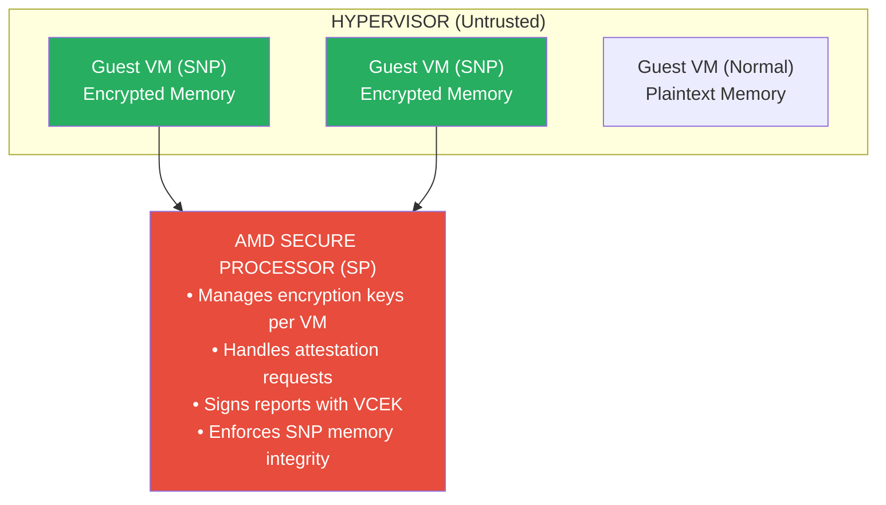

### Certificate Chain

AMD uses a simpler three-certificate chain compared to Intel:

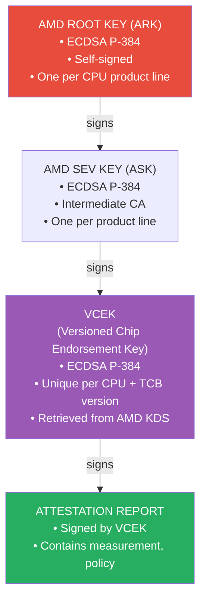

### VCEK Certificate Extensions

The VCEK certificate contains AMD-specific extensions (OID 1.3.6.1.4.1.3704.1.3.1.*):

| Extension OID | Name | Content |
|---------------|------|---------|
| .1 | Boot Loader SVN | uint8 |
| .2 | TEE SVN | uint8 |
| .3 | SNP SVN | uint8 |
| .4 | Microcode SVN | uint8 |
| .5 | Hardware ID | 128 bytes |
| .6 | Chip ID | 64 bytes |

### SNP Attestation Report Structure

The SNP attestation report is a fixed 1184-byte structure:

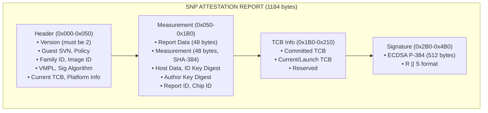

### The P-384 Challenge

AMD's use of P-384 (secp384r1) creates significant challenges for on-chain verification:

| Aspect | P-256 (Intel) | P-384 (AMD) |
|--------|---------------|-------------|
| EVM Precompile | RIP-7212 (3,450 gas) | None |
| Pure Solidity | ~350,000 gas | ~800,000–1,200,000 gas |
| Signature size | 64 bytes | 96 bytes |
| Public key size | 64 bytes | 96 bytes |

### On-Chain Strategy for AMD

Given the P-384 constraint, practical approaches:

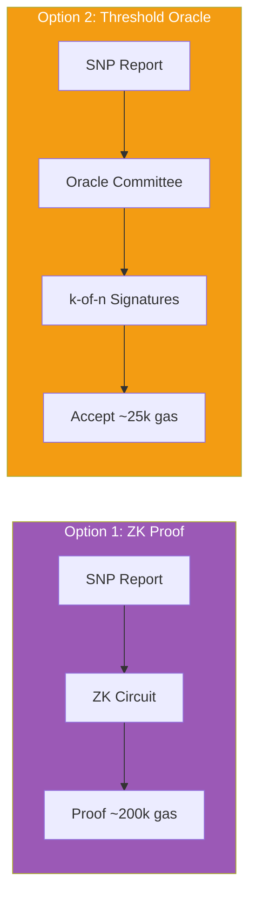

---

## AWS Nitro Enclaves

AWS Nitro Enclaves provide isolation on AWS infrastructure—but with a fundamentally different trust model. The root of trust is AWS's infrastructure, not silicon.

### Trust Model Difference

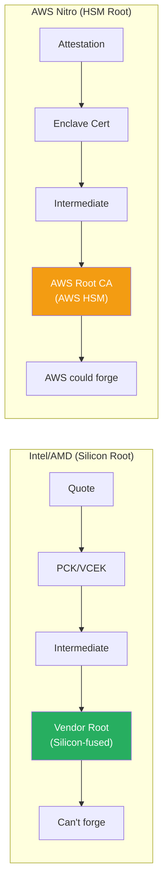

### Nitro Architecture

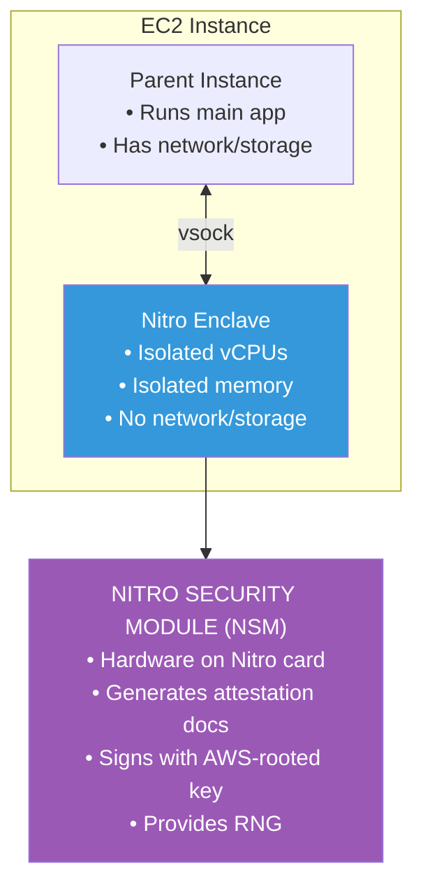

### PCR-Based Measurements

Nitro uses Platform Configuration Registers (PCRs) instead of a single measurement hash:

| PCR | Content |
|-----|---------|
| PCR0 | Enclave image file hash |
| PCR1 | Linux kernel and bootstrap hash |
| PCR2 | Application hash |
| PCR3 | IAM role assigned to parent instance |
| PCR4 | Instance ID of parent instance |
| PCR8 | Enclave image file signing certificate |

### Attestation Document Format

Nitro attestations use COSE Sign1 (CBOR Object Signing and Encryption):

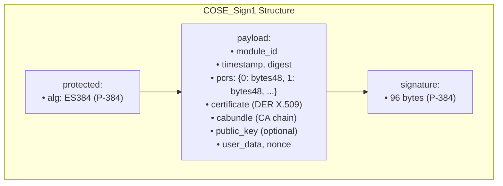

### Trust Implications

| Aspect | Intel/AMD | AWS Nitro |
|--------|-----------|-----------|
| Root key holder | Silicon (manufacturer can't extract) | AWS HSM |
| Forge attestation? | Impossible (without hardware compromise) | AWS could, theoretically |
| Audit root key? | No (but can't forge) | No (must trust AWS) |
| Collusion resistance | Manufacturer + attacker needed | AWS alone sufficient |

Nitro is appropriate when:
- You already trust AWS (e.g., AWS-hosted infrastructure)
- The threat model doesn't include AWS as adversary
- Convenience outweighs trust minimization

---

## ARM Confidential Compute Architecture (CCA)

ARM CCA is the newest entrant—designed for mobile and edge devices with increasing data center adoption.

### Architecture Overview

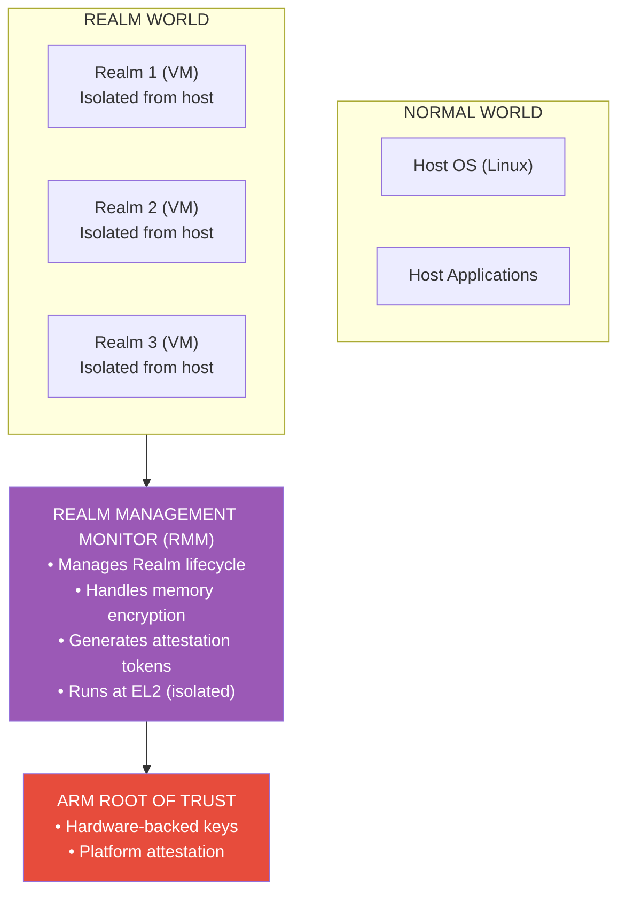

### CCA Attestation Token

CCA uses Entity Attestation Tokens (EAT) in CBOR format:

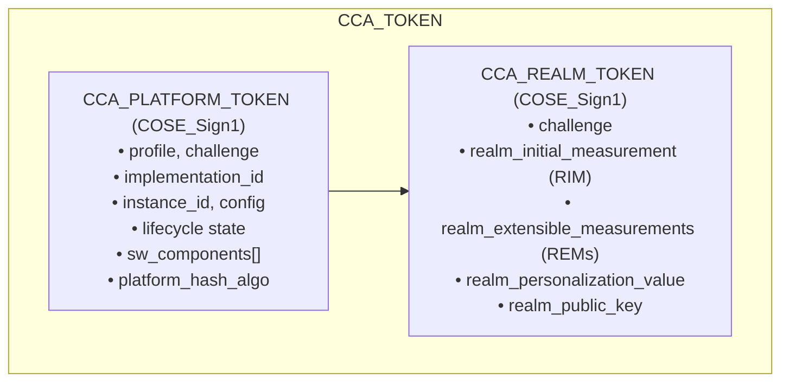

### On-Chain Status

ARM CCA is still emerging for blockchain use cases:

- **Limited tooling:** No equivalent to Automata's DCAP library
- **Variable cryptography:** P-256 or P-384 depending on implementation
- **CBOR parsing required:** Same challenge as Nitro
- **No production on-chain verifiers:** As of this writing

---

## Comparison Matrix

### Feature Comparison

| Feature | Intel SGX | Intel TDX | AMD SEV-SNP | AWS Nitro | ARM CCA |
|---------|-----------|-----------|-------------|-----------|---------|
| Isolation level | Process | VM | VM | VM | VM |
| Memory encryption | Yes | Yes | Yes | Yes | Yes |
| Root of trust | Silicon | Silicon | Silicon | AWS HSM | Silicon |
| Signature curve | P-256 | P-256 | P-384 | P-384 | P-256/P-384 |
| EVM precompile | RIP-7212 | RIP-7212 | None | None | Depends |
| On-chain maturity | High | Medium | Low | Low | None |

### On-Chain Verification Feasibility

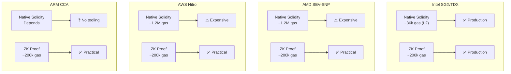

### Trust Spectrum

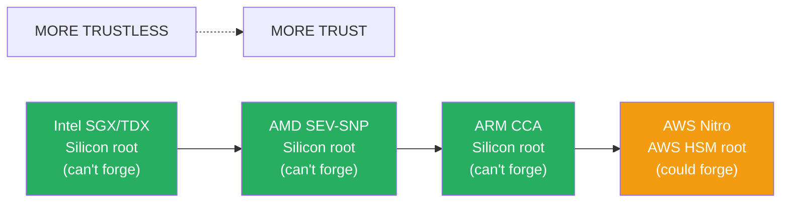

---

## Unified Verification Strategy

Building cross-platform attestation infrastructure requires abstraction:

### Abstract Interface

```solidity
/// @title Universal Attestation Verifier
/// @notice Platform-agnostic attestation verification interface

interface IUniversalAttestationVerifier {
    enum Platform {
        INTEL_SGX,
        INTEL_TDX,
        AMD_SEV_SNP,
        AWS_NITRO,
        ARM_CCA
    }
    
    struct AttestationResult {
        Platform platform;
        bytes32 measurementHash;    // Normalized measurement
        bytes32 reportDataHash;     // User-provided binding
        uint64 timestamp;
        bool tcbCurrent;            // Is TCB up to date?
    }
    
    /// @notice Verify attestation from any supported platform
    function verify(
        Platform platform,
        bytes calldata attestation,
        bytes calldata proof
    ) external view returns (AttestationResult memory result);
    
    /// @notice Check if measurement is in approved set
    function isApprovedMeasurement(
        Platform platform,
        bytes32 measurementHash
    ) external view returns (bool);
}
```

### ZK Abstraction Pattern

Since ZK is the practical path for non-Intel platforms, design around it:

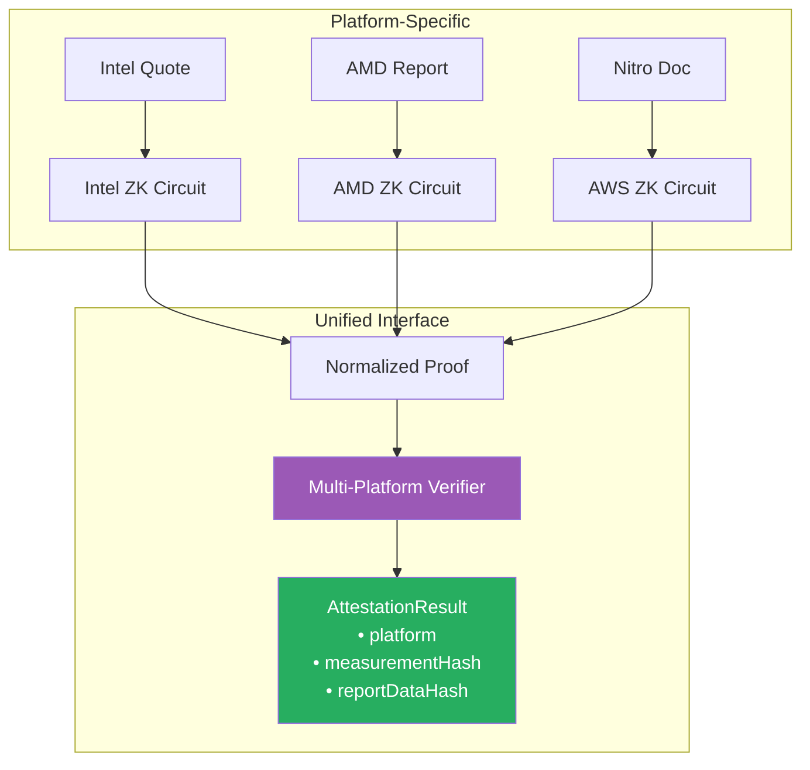

---

## Looking Ahead

Cross-platform attestation is becoming critical as the TEE landscape matures:

**Near-term:**
- ZK is the universal solution for non-Intel platforms
- Intel has first-mover advantage with RIP-7212
- AMD and AWS require ZK or oracle approaches

**Medium-term:**
- P-384 precompile proposals may emerge
- ARM CCA tooling will mature
- Unified attestation standards may develop

**Long-term:**
- Platform-agnostic verification becomes table stakes
- ZK circuits commoditize across platforms
- Trust model differences remain fundamental

The practical advice: design for abstraction. Use ZK verification where possible, build platform-agnostic interfaces, and prepare for a multi-vendor future.

---

---

**Previous:** [Part III — Intel DCAP Certificate Hierarchy](03-intel-dcap-certificate-hierarchy.md)  
**Next:** [Part V — Real-World Case Studies](05-real-world-case-studies.md)
