# Roots of Trust, Part V: Real-World Case Studies

*X.509, TEE Attestation, and Verifiable Infrastructure*

---

Theory meets production. Four projects have deployed TEE attestation in fundamentally different ways: Flashbots uses SGX to trustlessly replace centralized block builders. Taiko uses SGX as a fast prover alongside ZK for multi-proof security. Puffer uses SGX to prevent validator slashing. Scroll uses SGX as an independent verification layer for their zkEVM.

Each represents a distinct pattern for integrating attestation into blockchain infrastructure. This post examines their architectures, attestation flows, and the tradeoffs they've made.

---

## Flashbots: TEE-Based Block Building (SUAVE)

Flashbots is building SUAVE (Single Unified Auction for Value Expression)—a platform where MEV infrastructure runs inside TEEs instead of requiring trust in centralized operators.

### The Problem

Today's MEV supply chain requires trust:

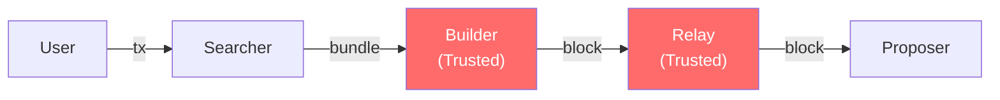

Searchers submit bundles to builders. Builders could front-run. Relays could censor. Users must trust that Flashbots (or other operators) won't abuse their position.

### The SUAVE Architecture

SUAVE replaces trusted operators with TEE-based "Kettles":

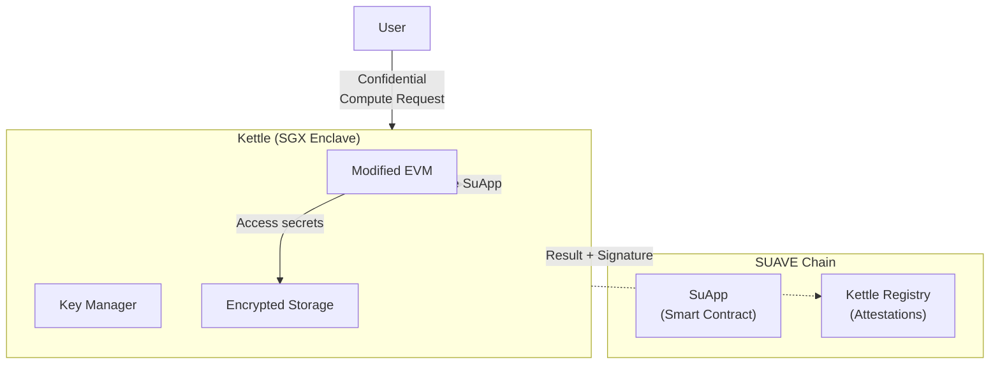

**Key components:**

| Component | Role |
|-----------|------|
| **Kettles** | SGX enclaves running the MEVM (Modified EVM) |
| **SuApps** | Smart contracts deployed to SUAVE chain, executed in Kettles |
| **Key Manager** | Distributes shared keys to attested Kettles |
| **Registry** | On-chain record of attested Kettle instances |

### Sirrah: The TEE Coprocessor Demo

Flashbots' Sirrah demo showed the practical implementation:

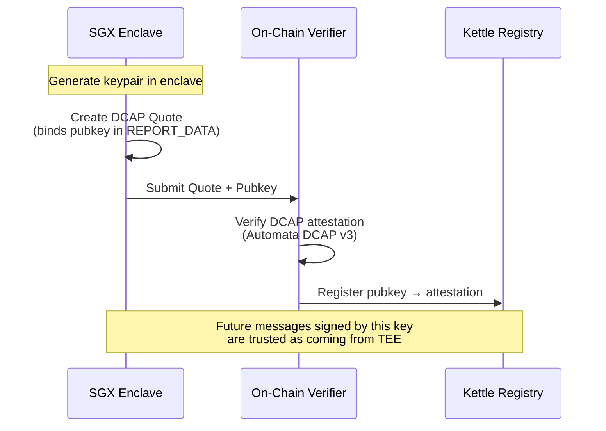

**Attestation pattern:**
1. Kettle generates a keypair inside SGX
2. Public key is bound into the DCAP quote's `REPORT_DATA`
3. Quote is verified on-chain using Automata's DCAP v3 Solidity library
4. Registry maps the public key to the verified attestation
5. Subsequent messages use cheap `ecrecover` instead of full attestation verification

### On-Chain Verification

Sirrah uses Automata's DCAP library for on-chain quote verification:

```solidity
/// @title Kettle Registry (Simplified)
/// @notice Registers SGX-attested Kettles for SUAVE

contract KettleRegistry {
    IAutomataDcapAttestation public dcapVerifier;
    
    // Registered Kettles: pubkey hash → attestation status
    mapping(bytes32 => AttestationRecord) public kettles;
    
    struct AttestationRecord {
        bool valid;
        bytes32 mrenclave;      // Expected enclave measurement
        uint64 registeredAt;
        uint64 tcbLevel;
    }
    
    // Expected MRENCLAVE for valid Kettle builds
    bytes32 public expectedMrenclave;
    
    /// @notice Register a new Kettle with DCAP attestation
    /// @param quote Raw DCAP quote from SGX enclave
    /// @param pubkey Public key bound in REPORT_DATA
    function registerKettle(
        bytes calldata quote,
        bytes calldata pubkey
    ) external {
        // Verify DCAP quote on-chain
        (bool success, ) = dcapVerifier.verifyAndAttestOnChain(quote);
        require(success, "DCAP verification failed");
        
        // Extract and verify MRENCLAVE
        bytes32 mrenclave = extractMrenclave(quote);
        require(mrenclave == expectedMrenclave, "Invalid enclave build");
        
        // Verify pubkey is bound in REPORT_DATA
        bytes32 reportData = extractReportData(quote);
        require(reportData == keccak256(pubkey), "Pubkey not bound");
        
        // Register the Kettle
        bytes32 pubkeyHash = keccak256(pubkey);
        kettles[pubkeyHash] = AttestationRecord({
            valid: true,
            mrenclave: mrenclave,
            registeredAt: uint64(block.timestamp),
            tcbLevel: extractTcbLevel(quote)
        });
        
        emit KettleRegistered(pubkeyHash, mrenclave);
    }
    
    /// @notice Verify a message came from registered Kettle
    function verifyKettleSignature(
        bytes32 messageHash,
        bytes calldata signature
    ) external view returns (bool) {
        address signer = ECDSA.recover(messageHash, signature);
        bytes32 pubkeyHash = keccak256(abi.encodePacked(signer));
        return kettles[pubkeyHash].valid;
    }
}
```

### Trust Model

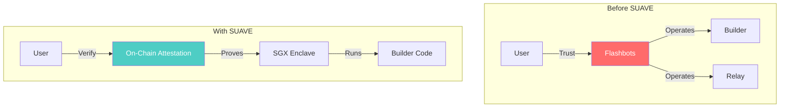

**What changes:**
- Trust in Flashbots → Trust in Intel SGX + on-chain verification
- Operator can't see orderflow (encrypted in enclave)
- Operator can't deviate from code (MRENCLAVE verified)
- Anyone can verify the attestation on-chain

### Current Status & Roadmap

| Phase | Status | TEE Role |
|-------|--------|----------|
| **Centauri** | ✅ Live | Trust Flashbots (no TEE) |
| **Andromeda** | 🔄 In progress | SGX Kettles |
| **Future** | Planned | Multi-vendor TEE + MPC fallback |

---

## Taiko: Multi-Prover with SGX Fast Path

Taiko is a based rollup that uses SGX provers alongside ZK provers in a multi-proof architecture.

### The Multi-Prover Philosophy

Single-prover rollups have a critical vulnerability: one bug in the prover can compromise all funds. Taiko's approach:

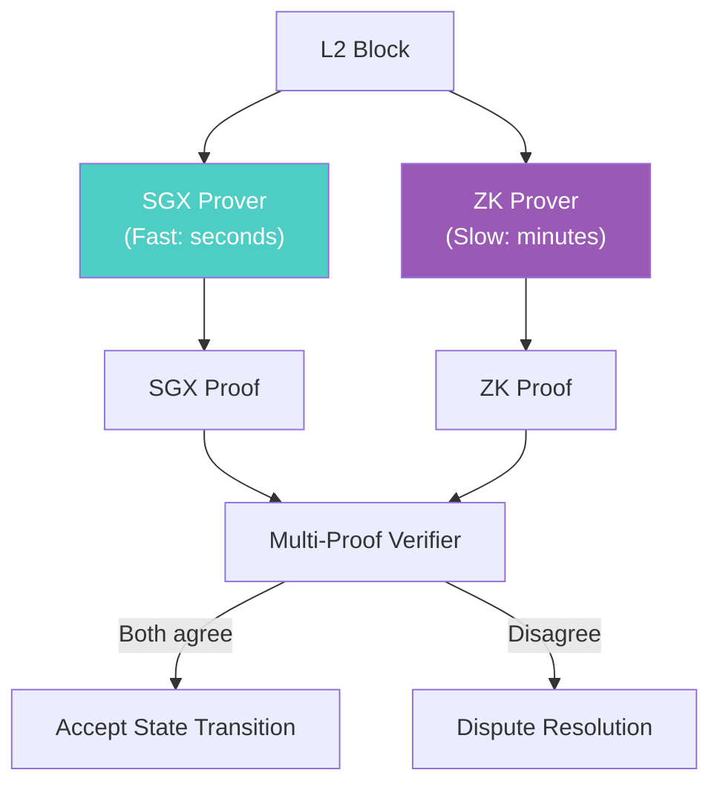

**Why both?**

| Prover | Speed | Trust Model | Failure Mode |
|--------|-------|-------------|--------------|
| **SGX** | Seconds | Hardware + Intel | Silicon vulnerability |
| **ZK** | Minutes | Math | Circuit bug |

Different failure modes mean an attacker would need to exploit *both* simultaneously.

### Raiko Architecture

Taiko's Raiko is a unified multi-prover framework:

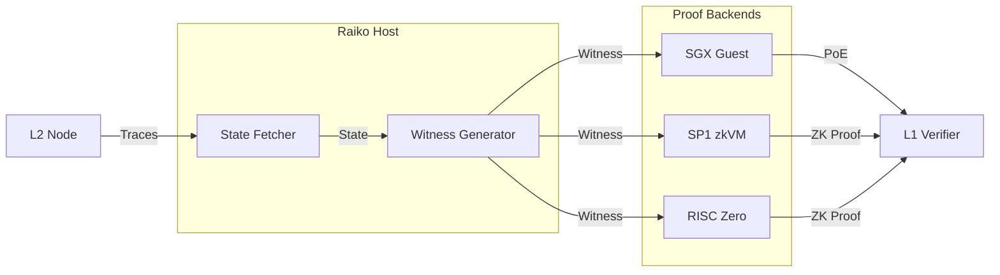

**Key insight:** All provers consume the same witness format. The host abstracts block fetching and state proof generation.

### SGX Prover Flow

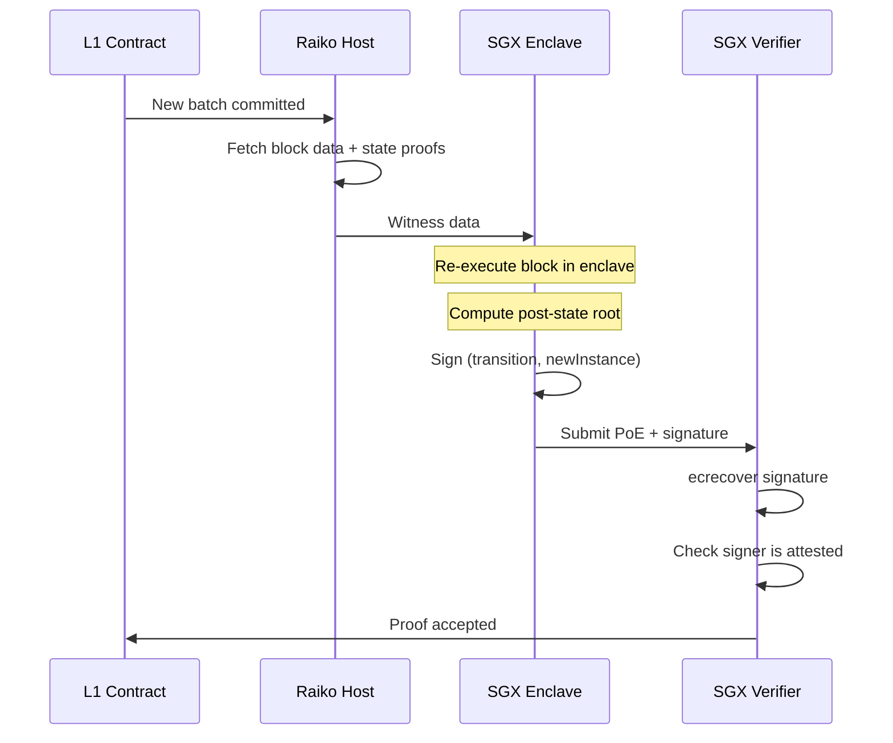

### Taiko's SGX Verifier Contract

From Taiko's actual implementation:

```solidity
/// @title SgxVerifier (Taiko Production)
/// @notice Verifies SGX proofs for Taiko blocks

contract SgxVerifier is EssentialContract, IVerifier {
    /// @notice Delay before a new SGX instance becomes valid
    uint64 public constant INSTANCE_VALIDITY_DELAY = 1 days;
    
    /// @notice Mapping of instance ID to SGX instance
    mapping(uint256 => Instance) public instances;
    
    /// @notice Tracks registered addresses
    mapping(address => bool) public addressRegistered;
    
    struct Instance {
        address addr;
        uint64 validSince;
    }
    
    /// @notice Verify SGX proof for a block transition
    function verifyProof(
        Context calldata _ctx,
        TaikoData.Transition calldata _tran,
        TaikoData.TierProof calldata _proof
    ) external {
        // Decode proof: (signature, newInstance, prover)
        (bytes memory signature, address newInstance, address prover) = 
            abi.decode(_proof.data, (bytes, address, address));
        
        // Verify signature from SGX enclave
        bytes32 signedHash = getSignedHash(
            _tran, 
            newInstance, 
            _ctx.prover, 
            _ctx.metaHash
        );
        
        address signer = ECDSA.recover(signedHash, signature);
        
        // Check signer is a valid SGX instance
        require(
            isValidInstance(signer),
            "SGX: Invalid instance"
        );
        
        // Optionally register new instance
        if (newInstance != address(0)) {
            _addInstance(newInstance);
        }
    }
    
    /// @notice Register SGX instances via DCAP attestation
    function registerInstance(
        V3Struct.ParsedV3QuoteStruct calldata _attestation
    ) external returns (uint256) {
        // Verify DCAP quote
        (bool verified, ) = IAttestation(
            resolve("automata_dcap_attestation", false)
        ).verifyParsedQuote(_attestation);
        
        require(verified, "SGX: Attestation failed");
        
        // Extract enclave-generated address from REPORT_DATA
        address instance = address(
            bytes20(_attestation.localEnclaveReport.reportData)
        );
        
        return _addInstance(instance);
    }
    
    function _addInstance(address _instance) private returns (uint256) {
        require(!addressRegistered[_instance], "SGX: Already registered");
        
        addressRegistered[_instance] = true;
        
        uint256 id = nextInstanceId++;
        instances[id] = Instance({
            addr: _instance,
            validSince: uint64(block.timestamp) + INSTANCE_VALIDITY_DELAY
        });
        
        return id;
    }
}
```

### Current Proof Requirements

As of early 2025, Taiko requires:

| Requirement | Details |
|-------------|---------|
| **Proof 1** | SGX (Geth) — mandatory |
| **Proof 2** | SGX (Reth) OR SP1 OR RISC Zero |
| **Proving window** | 2 hours |
| **ZK coverage** | Ramping to 100% through 2025 |

The dual-proof requirement means blocks need agreement from at least two independent execution environments.

---

## Puffer: Anti-Slashing with Secure-Signer

Puffer takes a different approach: using SGX to protect Ethereum validators from slashing, not to prove rollup state transitions.

### The Slashing Problem

Validators can be slashed for:
- **Double signing:** Signing two different blocks at the same height
- **Surround voting:** Attestations that contradict each other

These often happen due to operational errors, not malice:

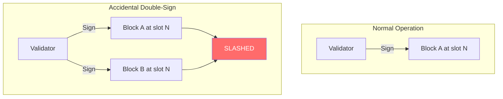

### Secure-Signer Architecture

Puffer's Secure-Signer moves key management into SGX:

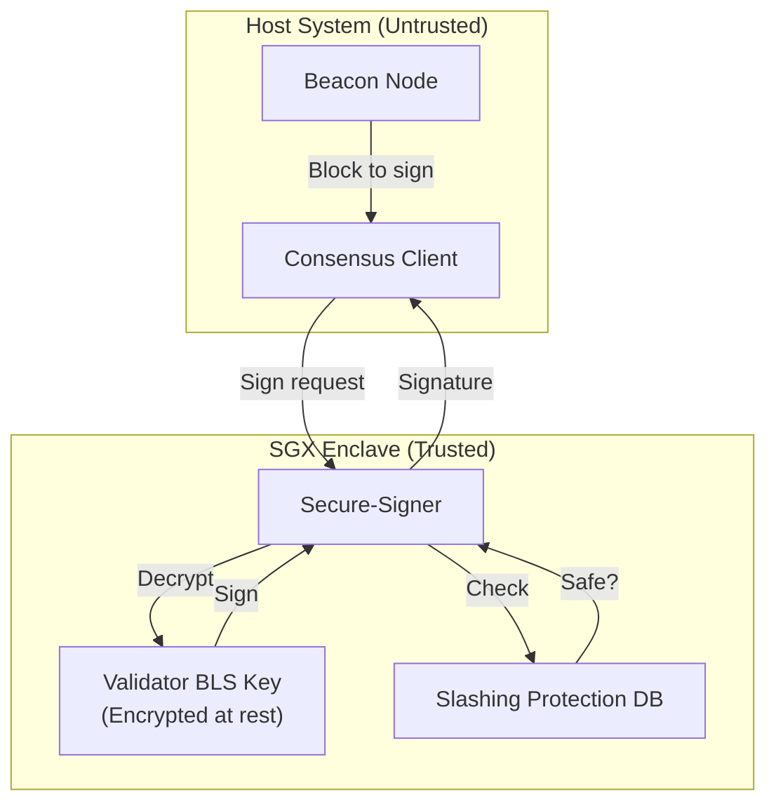

**Key properties:**
- BLS validator keys never leave the enclave unencrypted
- Slashing protection database is integrity-protected
- Even a compromised host can't extract keys or force double-signs

### RAVe: Remote Attestation Verification

Puffer's RAVe contracts verify that a node is running Secure-Signer:

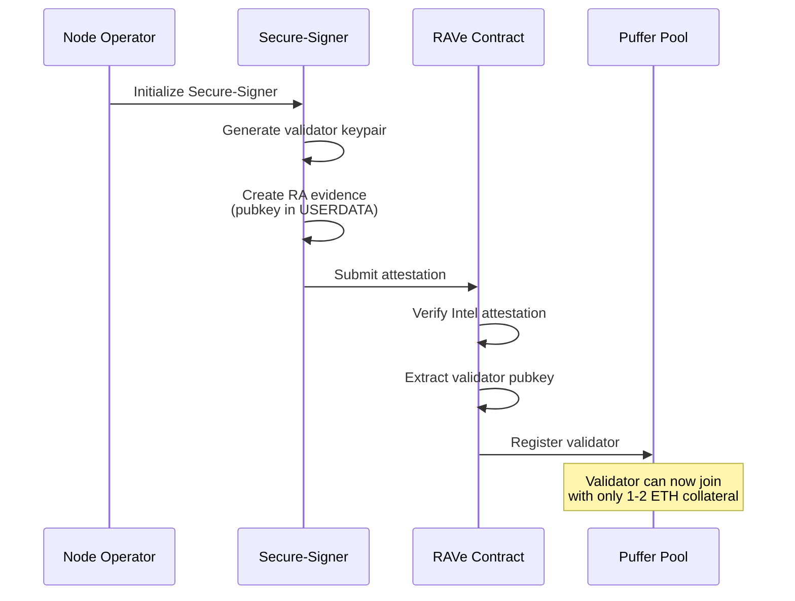

### RAVe Contract Structure

```solidity
/// @title RAVe (Remote Attestation Verification)
/// @notice Verifies SGX attestations for Puffer validators

interface IRAVe {
    /// @notice Verify attestation and extract validator pubkey
    /// @param report Intel SGX attestation report
    /// @param signature Intel signature on report
    /// @param signingCert Intel signing certificate
    /// @return pubkey BLS public key from USERDATA
    function verifyAndExtractPubkey(
        bytes calldata report,
        bytes calldata signature,
        bytes calldata signingCert
    ) external view returns (bytes memory pubkey);
}

contract PufferPool {
    IRAVe public rave;
    
    mapping(bytes => bool) public registeredValidators;
    
    /// @notice Register a new validator with SGX attestation
    function registerValidator(
        bytes calldata attestation,
        bytes calldata signature,
        bytes calldata cert,
        uint256 bondAmount
    ) external payable {
        // Minimum bond reduced because SGX prevents slashing
        require(bondAmount >= 1 ether, "Minimum 1 ETH");
        
        // Verify SGX attestation
        bytes memory pubkey = rave.verifyAndExtractPubkey(
            attestation,
            signature,
            cert
        );
        
        // Register validator
        registeredValidators[pubkey] = true;
        
        emit ValidatorRegistered(pubkey, msg.sender, bondAmount);
    }
}
```

### Trust Model Comparison

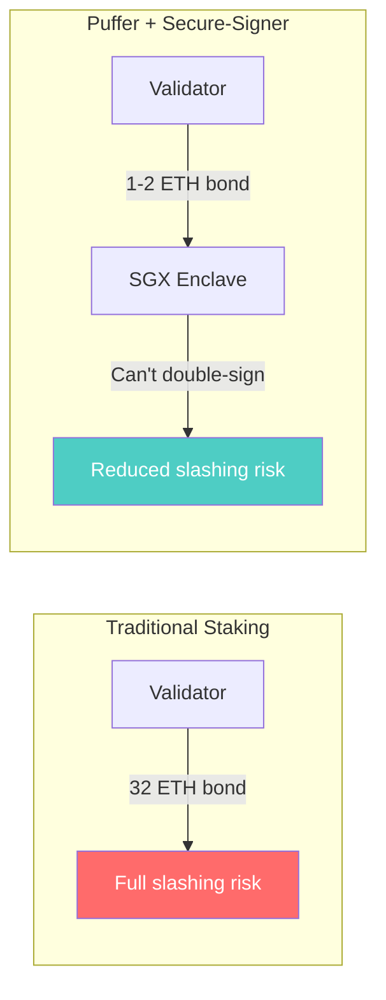

**Economic impact:**
- Traditional: 32 ETH bond, full slashing exposure
- Puffer: 1-2 ETH bond, SGX prevents accidental slashing
- Lower capital requirements → more decentralized validator set

---

## Scroll: TEE as Multi-Prover Layer

Scroll integrates SGX as an independent verification layer alongside their zkEVM.

### The Multi-Prover Rationale

ZK circuits are complex. Bugs have been found in production systems (e.g., zkSync Era's $1.9B vulnerability reported by ChainLight). Scroll's defense:

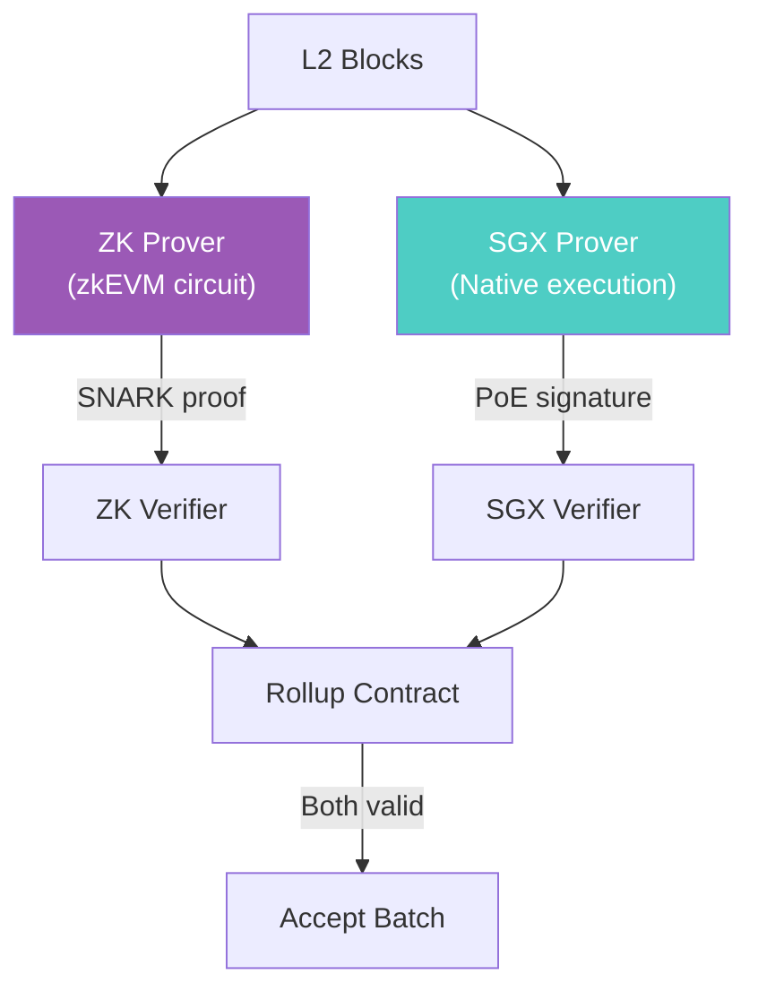

**Why this works:**
- ZK bug? SGX catches the invalid state transition
- SGX compromised? ZK proof would fail for wrong state
- Need to exploit *both* simultaneously

### Scroll's TEE Prover Architecture

Developed with Automata Network:

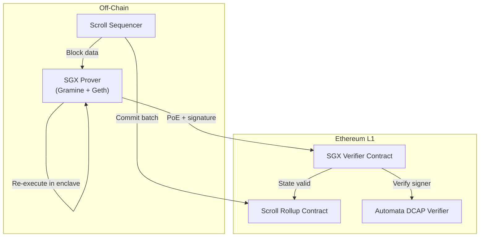

### SGX Prover Components

| Component | Function |
|-----------|----------|
| **Proof of Block (PoB)** | Block data + state needed for re-execution |
| **Proof of Execution (PoE)** | Signed assertion: "post-state root is X" |
| **Attestation** | DCAP quote proving SGX enclave authenticity |

### Verification Flow

```solidity
/// @title Scroll SGX Verifier (Simplified)
/// @notice Verifies SGX proofs for Scroll batches

contract ScrollSGXVerifier {
    IAutomataDcapAttestation public dcap;
    
    // Registered SGX provers
    mapping(address => bool) public attestedProvers;
    
    struct ProofOfExecution {
        bytes32 batchHash;
        bytes32 prevStateRoot;
        bytes32 postStateRoot;
        bytes signature;
    }
    
    /// @notice Register an SGX prover via DCAP attestation
    function registerProver(bytes calldata quote) external {
        // Verify DCAP quote
        (bool success, bytes memory output) = dcap.verifyAndAttestOnChain(quote);
        require(success, "DCAP failed");
        
        // Extract prover address from REPORT_DATA
        address prover = extractProverAddress(quote);
        attestedProvers[prover] = true;
        
        emit ProverRegistered(prover);
    }
    
    /// @notice Verify a Proof of Execution
    function verifyPoE(
        ProofOfExecution calldata poe
    ) external view returns (bool) {
        // Reconstruct signed message
        bytes32 message = keccak256(abi.encodePacked(
            poe.batchHash,
            poe.prevStateRoot,
            poe.postStateRoot
        ));
        
        // Recover signer
        address signer = ECDSA.recover(message, poe.signature);
        
        // Check signer is attested
        return attestedProvers[signer];
    }
}
```

### Gas Efficiency

The SGX verification is extremely gas-efficient after initial attestation:

| Operation | Gas Cost |
|-----------|----------|
| **Initial DCAP attestation** | ~3M gas (one-time) |
| **Per-batch PoE verification** | ~3,000 gas (ecrecover) |

This makes SGX proofs economically viable as an always-on second verification layer.

---

## Cross-Project Comparison

### Attestation Patterns

| Project | Attestation Timing | On-Chain Verification | Purpose |
|---------|-------------------|----------------------|---------|
| **Flashbots** | Registration | Full DCAP | Kettle identity |
| **Taiko** | Registration | Full DCAP | Prover identity |
| **Puffer** | Registration | EPID/DCAP | Validator identity |
| **Scroll** | Registration | Full DCAP | Prover identity |

All projects use "attest once, sign many" pattern: expensive attestation verification at registration, cheap signatures thereafter.

### Architecture Comparison

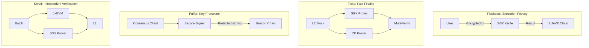

### When to Use Each Pattern

| Pattern | Use When |
|---------|----------|
| **Execution Privacy** (Flashbots) | Need to hide computation inputs from operator |
| **Fast Finality** (Taiko) | Need quick proofs with ZK as safety net |
| **Key Protection** (Puffer) | Managing high-value signing keys |
| **Independent Verification** (Scroll) | Adding redundancy to existing proof system |

---

## Common Implementation Patterns

### Pattern 1: Attest-Once, Sign-Many

All four projects use this gas optimization:

```solidity
/// @notice Standard pattern: register with attestation, verify with signature

contract AttestOnceSignMany {
    mapping(address => bool) public registered;
    
    // Expensive: full DCAP verification (~3M gas)
    function register(bytes calldata dcapQuote) external {
        require(verifyDCAP(dcapQuote), "Invalid attestation");
        address enclave = extractAddress(dcapQuote);
        registered[enclave] = true;
    }
    
    // Cheap: signature verification (~3k gas)
    function verifyMessage(
        bytes32 message,
        bytes calldata signature
    ) external view returns (bool) {
        address signer = ECDSA.recover(message, signature);
        return registered[signer];
    }
}
```

### Pattern 2: Measurement Whitelisting

Ensure only approved code runs in enclaves:

```solidity
contract MeasurementWhitelist {
    mapping(bytes32 => bool) public approvedMeasurements;
    
    function register(bytes calldata quote) external {
        bytes32 mrenclave = extractMrenclave(quote);
        require(approvedMeasurements[mrenclave], "Unapproved code");
        // ... rest of registration
    }
    
    // Governance function to approve new builds
    function approveMeasurement(bytes32 mrenclave) external onlyGovernance {
        approvedMeasurements[mrenclave] = true;
    }
}
```

### Pattern 3: TCB Monitoring

Handle Intel security updates:

```solidity
contract TCBMonitor {
    uint64 public minimumTcbLevel;
    mapping(address => uint64) public instanceTcbLevels;
    
    function register(bytes calldata quote) external {
        uint64 tcbLevel = extractTcbLevel(quote);
        require(tcbLevel >= minimumTcbLevel, "TCB outdated");
        
        address instance = extractAddress(quote);
        instanceTcbLevels[instance] = tcbLevel;
    }
    
    // Called when Intel releases security update
    function updateMinimumTcb(uint64 newMinimum) external onlyGovernance {
        minimumTcbLevel = newMinimum;
        emit TcbRequirementUpdated(newMinimum);
    }
    
    // Invalidate instances below new minimum
    function pruneOutdatedInstances(
        address[] calldata instances
    ) external {
        for (uint i = 0; i < instances.length; i++) {
            if (instanceTcbLevels[instances[i]] < minimumTcbLevel) {
                // Deregister or flag as invalid
            }
        }
    }
}
```

---

## Lessons Learned

### What Works

1. **Attest-once pattern is essential** — Full DCAP verification is too expensive per-transaction
2. **SGX for speed, ZK for finality** — Complementary, not competing
3. **Open-source attestation libraries** — Automata's DCAP v3 enabled multiple projects
4. **Reproducible builds** — Critical for MRENCLAVE verification

### Current Limitations

1. **Intel dependency** — All four projects use Intel SGX; AMD SEV-SNP support emerging
2. **Collateral management** — TCBInfo/QEIdentity updates require governance
3. **Hardware availability** — SGX-capable instances not universally available
4. **Side-channel risks** — Spectre/Meltdown class vulnerabilities remain a concern

### Future Directions

| Trend | Projects Exploring |
|-------|-------------------|
| **Multi-vendor TEE** | Automata (AMD SEV-SNP SDK) |
| **ZK-compressed attestation** | Automata + RISC Zero (8x cheaper) |
| **TEE committees** | Automata Multi-Prover AVS |
| **TDX migration** | All projects evaluating |

---

## Conclusion

Four projects, four patterns, one common foundation: Intel SGX attestation verified on-chain.

| Project | Pattern | Key Insight |
|---------|---------|-------------|
| **Flashbots** | Execution privacy | Replace trusted operators with verified enclaves |
| **Taiko** | Multi-prover | SGX provides fast path, ZK provides safety net |
| **Puffer** | Key protection | Hardware-enforced slashing prevention |
| **Scroll** | Independent verification | Redundancy against ZK circuit bugs |

The infrastructure is maturing. Automata's DCAP library has become the de facto standard. The "attest once, sign many" pattern is universal. Multi-vendor support is coming.

TEE attestation is no longer experimental—it's production infrastructure.

---

---

**Previous:** [Part IV — Cross-Platform Attestation](04-cross-platform-attestation.md)  
**Next:** Part VI — Failure Modes *(coming soon)*
